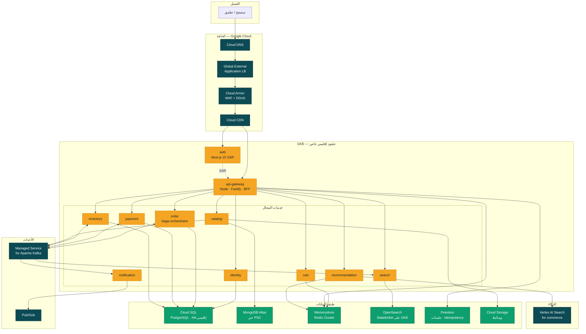
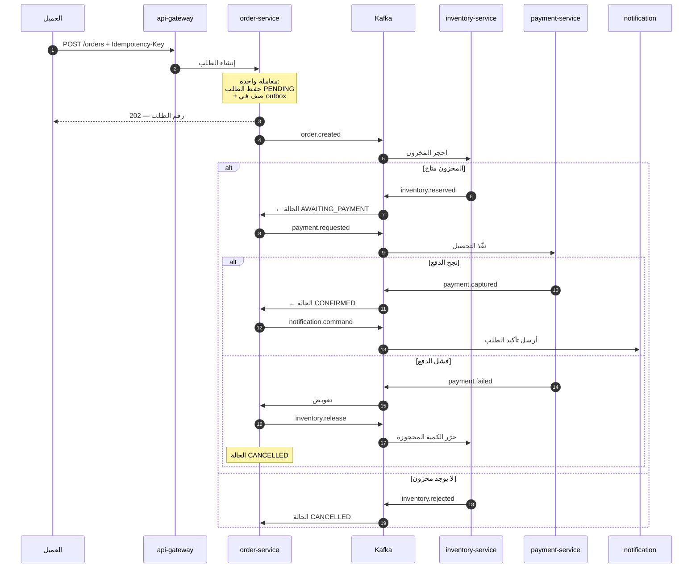
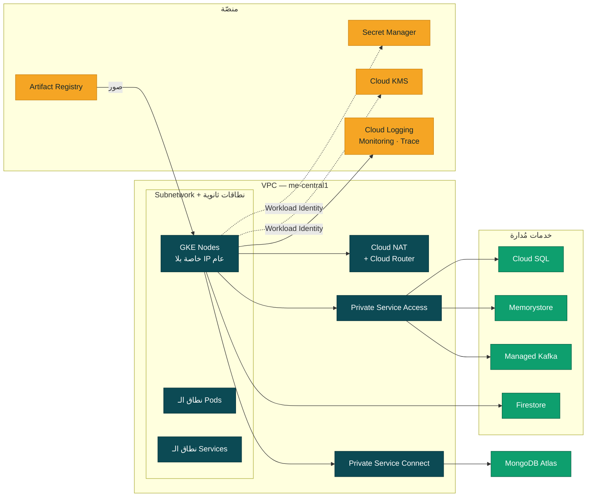

<div align="center">

# TopChoice

**منصة تجارة إلكترونية عربية مبنية كـ microservices ومصمَّمة من الأساس لـ Google Cloud**

عشر خدمات مستقلة · Saga موزّعة مع تعويض · واجهة Next.js بالعربية RTL · لوحة تحكم كاملة

</div>

---

## 1. لمحة سريعة

| | |
|---|---|
| **الخدمات** | 10 microservices بثلاث لغات — Java 21 · Node 22 · Python 3.12 |
| **السحابة** | Google Cloud — GKE · Cloud SQL · Memorystore · Managed Kafka · Firestore |
| **التخزين** | PostgreSQL · MongoDB · Redis · OpenSearch · Cloud Storage |
| **الاتساق** | Saga بالتنسيق + Transactional Outbox + مفاتيح تعطيل التكرار |
| **الاختبارات** | 106 اختبار وحدة على منطق المجال · 27 حالة تكامل على المتجر · 28 على لوحة التحكم |
| **التشغيل المحلي** | `make up` — عشرون حاوية، بلا تسطيب Java أو Python على جهازك |

```bash
make up && make seed
```

ثم <http://localhost:3000>.

---

## 2. معمارية النظام

الطلب يدخل من الحافة، يمرّ بـ BFF واحد يجمّع ما تحتاجه الصفحة، وينتهي عند خدمة
تملك بياناتها وحدها. لا خدمة تقرأ قاعدة بيانات خدمة أخرى — التواصل إمّا نداء
متزامن عبر البوابة أو حدث غير متزامن عبر Kafka.



### مسار إنشاء الطلب — Saga بالتنسيق

المشكلة: إنشاء طلب يمسّ ثلاث قواعد بيانات في ثلاث خدمات. المعاملة الموزّعة (2PC)
تقفل الموارد عبر الشبكة وتجعل عطل خدمة واحدة عطلًا للكل. البديل المتبنّى هنا:
كل خطوة معاملة محلية، و`order-service` ينسّق ويعوّض عند الفشل.



**ثلاث آليات تحمي هذا المسار:**

| الآلية | المشكلة التي تحلّها |
|---|---|
| **Transactional Outbox** | الحفظ في قاعدة البيانات ونشر الحدث لا يمكن أن يكونا معاملة واحدة. نكتب الحدث في جدول `outbox` داخل نفس معاملة الطلب، ثم يقرأه relay وينشره. إمّا يحدث الاثنان أو لا شيء. |
| **`processed_events`** | Kafka يضمن التسليم مرة واحدة على الأقل، أي أن التكرار وارد. كل مستهلك يسجّل `(event_id, consumer)` بمفتاح فريد، فالحدث المكرر يُتجاهل بلا أثر. |
| **`Idempotency-Key`** | ضغطة مزدوجة على «ادفع» أو إعادة محاولة من الشبكة يجب ألّا تنتج طلبين. المفتاح مخزَّن ومربوط بالطلب الناتج. |

---

## 3. معمارية قواعد البيانات

القاعدة الحاكمة: **قاعدة بيانات لكل خدمة**. لا مفاتيح أجنبية عبر الحدود — العلاقة
بين خدمة وأخرى تُمثَّل بمعرّف مجرّد يُحلّ عبر API أو حدث. الثمن أن بعض البيانات
تُكرَّر (اسم المنتج وسعره داخل `order_items`)، والمكسب أن تغيير سعر في الكتالوج لا
يغيّر فاتورة صدرت الشهر الماضي.

```mermaid
erDiagram
    USERS ||--o{ USER_ROLES : "له"
    USERS ||--o{ ADDRESSES : "يملك"
    USERS ||--o{ REFRESH_TOKENS : "يصدر"

    USERS {
        uuid id PK
        citext email UK "غير حسّاس لحالة الأحرف"
        varchar phone UK
        text password_hash "BCrypt"
        varchar full_name
        varchar status "ACTIVE | SUSPENDED"
        timestamptz created_at
    }
    USER_ROLES {
        uuid user_id FK
        varchar role "CUSTOMER | ADMIN"
    }
    ADDRESSES {
        uuid id PK
        uuid user_id FK
        varchar city
        numeric lat
        numeric lng
        boolean is_default
    }
    REFRESH_TOKENS {
        uuid id PK
        uuid user_id FK
        varchar token_hash UK "SHA-256 — لا نخزّن التوكن"
        uuid family_id "لكشف إعادة الاستخدام"
        timestamptz revoked_at
    }

    ORDERS ||--|{ ORDER_ITEMS : "يحوي"
    ORDERS {
        uuid id PK
        varchar order_number UK
        uuid user_id "لا FK — حدّ خدمة"
        varchar status "آلة حالات"
        bigint subtotal_minor "قروش لا كسور عشرية"
        bigint tax_minor
        bigint total_minor
        jsonb shipping_address "لقطة وقت الطلب"
        uuid payment_id
        bigint version "قفل متفائل"
    }
    ORDER_ITEMS {
        uuid id PK
        uuid order_id FK
        varchar sku "لا FK — حدّ خدمة"
        varchar title "لقطة: لا تتأثر بتغيّر الكتالوج"
        bigint unit_price_minor
        integer quantity
    }
    OUTBOX {
        uuid id PK
        varchar aggregate_id
        varchar event_type
        varchar topic
        jsonb payload
        integer attempts
        timestamptz published_at "NULL = لم يُنشر"
    }
    IDEMPOTENCY_KEYS {
        varchar key PK
        uuid user_id
        uuid order_id
    }

    PAYMENTS ||--o{ REFUNDS : "يُسترد عبر"
    PAYMENTS ||--o{ PAYMENT_AUDIT : "يسجّل"
    PAYMENTS {
        uuid id PK
        uuid order_id UK "واحد لواحد مع الطلب"
        bigint amount_minor
        varchar status "REQUIRES_AUTH → CAPTURED"
        varchar provider_ref "مرجع البوابة"
    }
    REFUNDS {
        uuid id PK
        uuid payment_id FK
        bigint amount_minor
        varchar status
    }
    PAYMENT_AUDIT {
        bigserial id PK
        uuid payment_id
        varchar from_status
        varchar to_status
        timestamptz created_at
    }

    STOCK_ITEMS ||--o{ RESERVATIONS : "يُحجز منه"
    STOCK_ITEMS {
        varchar sku PK
        varchar warehouse_id
        integer on_hand "CHECK >= 0"
        integer reserved "CHECK >= 0"
        bigint version "قفل متفائل"
    }
    RESERVATIONS {
        uuid id PK
        uuid order_id
        varchar sku FK
        integer quantity
        varchar status "HELD | COMMITTED | RELEASED"
        timestamptz expires_at "حجز منتهٍ يُحرَّر تلقائيًا"
    }

    PROCESSED_EVENTS {
        uuid event_id PK "مع consumer"
        varchar consumer PK
        timestamptz processed_at
    }
```



> `PROCESSED_EVENTS` ليس جدولًا واحدًا — نسخة منه في كل خدمة مستهلِكة
> (order · payment · inventory)، لأن تعطيل التكرار مسؤولية المستهلك لا المنتج.

### توزيع المخازن ولماذا

| المخزن | الخدمة | ما فيه | لماذا هذا المخزن تحديدًا |
|---|---|---|---|
| **Cloud SQL** PostgreSQL | identity · order · payment · inventory | المستخدمون، الطلبات، المدفوعات، المخزون | مال ومخزون: نحتاج ACID، قفل صفوف تحت التزاحم، وتدقيقًا محاسبيًا. لا بديل. |
| **MongoDB Atlas** | catalog | مستندات المنتجات والأقسام | كل قسم له مواصفات مختلفة تمامًا: مقاس الحذاء ليس دقّة الكاميرا. مخطط صارم هنا يعني عشرات الأعمدة الفارغة أو جدول EAV. |
| **Memorystore** Redis | cart · gateway · recommendation | السلة، الكاش، حدود المعدّل | السلة بيانات عابرة عالية التردد. فقدانها مزعج لا كارثي، وثمن جعلها معاملاتية أعلى من قيمتها. |
| **OpenSearch** | search | فهرس المنتجات | بحث عربي بتحليل صرفي، facets، وترتيب بالصلة. PostgreSQL يقدر على `LIKE` لا على هذا. |
| **Firestore** | gateway | الجلسات ومفاتيح التكرار | مفتاح/قيمة مع TTL أصلي وقياس تلقائي. كان DynamoDB على AWS. |
| **Cloud Storage** | catalog | صور المنتجات | كائنات كبيرة خلف CDN. |

### شكل مستند المنتج

```jsonc
{
  "sku": "TC-APL-IP15-128-BLK",
  "slug": "apple-iphone-15-128gb-black",
  "title":       { "ar": "آيفون ١٥", "en": "iPhone 15" },  // نص متعدد اللغات
  "description": { "ar": "…",        "en": "…" },
  "brand":       { "id": "apple", "name": "Apple" },
  "categoryPath": ["electronics", "mobiles", "smartphones"],
  "price":  { "currency": "EGP", "amountMinor": 4499900, "wasMinor": 5299900 },
  "images": ["https://…"],
  "attributes": { "storage": "128GB", "color": "أسود" },    // مخطط حرّ لكل قسم
  "variants":   [{ "sku": "…", "attributes": { … } }],
  "rating": { "average": 4.6, "count": 1284 },
  "tags": ["express", "bestseller"],
  "status": "ACTIVE",                                        // الأرشفة لا الحذف
  "version": 7
}
```

### قاعدة المال

كل المبالغ `BIGINT` بالوحدة الصغرى (قرش)، لا `FLOAT` ولا `DOUBLE` في أي مكان.
`0.1 + 0.2 ≠ 0.3` في الفاصلة العائمة، وفرق مليم واحد في مليون طلب فضيحة محاسبية.
التحويل يحدث مرة واحدة عند حدود العرض: المشرف يُدخل `1250.50` فنخزّن `125050`.

---

## 4. الخدمات

| # | الخدمة | اللغة | المخزن | المسؤولية |
|---|---|---|---|---|
| 1 | `api-gateway` | Node · Fastify | Redis | BFF، توجيه، JWT، حدّ المعدّل، كاش الاستجابات |
| 2 | `identity-service` | Java · Spring Boot | PostgreSQL | تسجيل، دخول، تدوير refresh، العناوين |
| 3 | `catalog-service` | Java · Spring Boot | MongoDB | المنتجات، الأقسام، العلامات، الأسعار |
| 4 | `inventory-service` | Java · Spring Boot | PostgreSQL | المخزون، الحجز والإفراج |
| 5 | `order-service` | Java · Spring Boot | PostgreSQL | الطلبات + **منسّق الـ Saga** + Outbox |
| 6 | `payment-service` | Java · Spring Boot | PostgreSQL | التفويض، التحصيل، الاسترداد |
| 7 | `cart-service` | Node · Fastify | Redis | السلة (زائر + مستخدم) ودمجها عند الدخول |
| 8 | `notification-service` | Node | Pub/Sub | إيميل / SMS / Web-Push من أحداث Kafka |
| 9 | `search-service` | Python · FastAPI | OpenSearch | بحث، فلاتر، facets، إكمال تلقائي |
| 10 | `recommendation-service` | Python · FastAPI | Vertex AI + Redis | «مقترح لك» و«اشتُري معه» |

### مواضيع Kafka

| الموضوع | المنتِج | المستهلكون |
|---|---|---|
| `order.events.v1` | order | inventory · payment |
| `inventory.events.v1` | inventory | order |
| `payment.events.v1` | payment | order |
| `catalog.product.v1` | catalog | search |
| `notification.commands.v1` | order | notification |

---

## 5. البنية التحتية على Google Cloud



**بلا مفاتيح ثابتة في أي مكان.** الـ Pods تتوثّق بـ **Workload Identity**، وخط
النشر في GitHub Actions يتوثّق بـ **Workload Identity Federation** — لا ملف JSON
لحساب خدمة يُخزَّن كسرّ في المستودع.

| الفئة | الخدمة |
|---|---|
| التنسيق | GKE إقليمي خاص · Node auto-provisioning · HPA · KEDA |
| قواعد البيانات | Cloud SQL PostgreSQL (HA + PITR) · MongoDB Atlas · Memorystore Redis Cluster · Firestore |
| الأحداث | Managed Service for Apache Kafka · Pub/Sub |
| الحافة | Global External ALB · Cloud CDN · Cloud Armor · Cloud DNS · Certificate Manager |
| المنصّة | Artifact Registry · Secret Manager · Cloud KMS · Cloud Storage |
| الذكاء | Vertex AI Search for commerce |
| المراقبة | Cloud Logging · Cloud Monitoring · Cloud Trace · OpenTelemetry · Prometheus |

> **صراحةً:** لا تملك Google Cloud خدمة OpenSearch مُدارة ولا خدمة بريد أصلية.
> نشغّل OpenSearch كـ StatefulSet على GKE، ونستخدم SendGrid للبريد. التفاصيل
> وكلفة هذا القرار في [docs/02-gcp-services.md](docs/02-gcp-services.md).

---

## 6. التشغيل المحلي

المتطلبات: Docker و Docker Compose فقط. لا Java ولا Maven ولا Python على جهازك —
كل بناء يحدث داخل حاوية.

```bash
make up      # عشرون حاوية: قواعد البيانات + Kafka + OpenSearch + المحاكيات + الخدمات
make seed    # بيانات تجريبية
make smoke        # 27 حالة تكامل على المتجر
make admin-test   # 28 حالة تكامل على لوحة التحكم
make test         # اختبارات الوحدة لكل الخدمات + فحص البنية
make down    # إيقاف
```

| الواجهة | الرابط |
|---|---|
| المتجر | <http://localhost:3000> |
| لوحة التحكم | <http://localhost:3000/admin> |
| API Gateway | <http://localhost:8080> |
| OpenSearch Dashboards | <http://localhost:5601> |
| Kafka UI | <http://localhost:8090> |
| Mailpit (اختبار البريد) | <http://localhost:8025> |

| الحساب | البريد | كلمة المرور |
|---|---|---|
| عميل | `demo@topchoice.local` | `Passw0rd!` |
| مشرف | `admin@topchoice.local` | `Admin@123` |

### اختبارات الوحدة

106 اختبارًا على منطق المجال، بلا حاويات ولا قاعدة بيانات — تعمل في ثوانٍ:

| الخدمة | ما تحرسه |
|---|---|
| `order-service` | آلة حالات الطلب: الحالات النهائية ماصّة، لا رجوع للخلف، `CONFIRMED → DELIVERED` مرفوض، وكل حالة قبل الشحن تجد طريقًا للإلغاء. وحساب المال: الضريبة بعد الخصم، الخصم محكوم بقيمة السلة، ولا كسور عائمة |
| `inventory-service` | ثابت `available = onHand − reserved` عبر دورة حياة كاملة، ورفض الحجز فوق المتاح، والإفراج المكرر لا يجعل المحجوز سالبًا |
| `identity-service` | رفض المفاتيح المعروفة رغم طولها الكافي، وعدم تغيّر لحظة سحب التوكن عند التكرار |
| `payment-service` | التحصيل بلا مرجع يحافظ على مرجع التفويض، وإعادة التفويض تمحو رمز الفشل السابق |
| `catalog-service` | نسبة الخصم تُحسب من السعر القديم، والتقريب لا البتر — والحالات نفسها مُختبَرة في نسخة TypeScript لضمان تطابق الرقمين |

**ما يغطيه اختبار الدخان:** الصحة · الكتالوج والأقسام · صفحة المنتج المجمّعة ·
البحث العربي والإنجليزي والإكمال التلقائي · التوصيات · المخزون · الدخول ورفض
كلمة المرور الخاطئة · السلة والمجموع المحسوب على الخادم · **الـ Saga كاملة**
(`PENDING → AWAITING_PAYMENT → CONFIRMED` خلال ثوانٍ) · التسعير من مصدره · منع
الطلب المكرر · حجب المسارات الداخلية والإدارية عند الحافة.

---

## 7. النشر على Google Cloud

```bash
make tf-init
make tf-plan
make tf-apply
make kubeconfig
make deploy-gke
```

الدليل خطوة بخطوة في [docs/06-deployment-gke.md](docs/06-deployment-gke.md).

---

## 8. التوثيق

| المستند | المحتوى |
|---|---|
| [01-architecture.md](docs/01-architecture.md) | المعمارية، المخططات، تدفّق الطلب، الـ Saga |
| [02-gcp-services.md](docs/02-gcp-services.md) | كل خدمة GCP مستخدمة ولماذا — والبدائل التي رُفضت |
| [03-data-model.md](docs/03-data-model.md) | نماذج البيانات SQL/NoSQL وأحداث Kafka |
| [04-scalability.md](docs/04-scalability.md) | التوسّع، موازنة الحمل، الكاش، الصمود |
| [05-local-development.md](docs/05-local-development.md) | دليل التطوير المحلي |
| [06-deployment-gke.md](docs/06-deployment-gke.md) | النشر على GKE خطوة بخطوة |
| [07-security.md](docs/07-security.md) | الأمان والامتثال |
| [08-admin-dashboard.md](docs/08-admin-dashboard.md) | لوحة التحكم: الشاشات والصلاحيات وقواعد الخادم |

### قرارات المعمارية (ADRs)

| # | القرار | الخلاصة |
|---|---|---|
| [0001](docs/adr/0001-microservices-boundaries.md) | حدود الخدمات | التقسيم حسب حدود السياق لا الطبقات التقنية |
| [0002](docs/adr/0002-saga-over-2pc.md) | Saga بدل 2PC | لا معاملات موزّعة — تنسيق مركزي مع تعويض |
| [0003](docs/adr/0003-polyglot-persistence.md) | تعدّد مخازن البيانات | المخزن يتبع شكل البيانات ومتطلبات الاتساق |
| [0004](docs/adr/0004-bff-gateway.md) | بوابة BFF | رحلة شبكة واحدة بدل أربع، وتدهور متدرّج مركزي |
| [0005](docs/adr/0005-gke-over-alternatives.md) | GKE بدل Cloud Run | أحمال طويلة العمر + قابلية نقل — مع الاعتراف بكلفة التعقيد |

---

## 9. الهوية البصرية

**«Petrol & Saffron»** — مشتقّة من عالم السوق نفسه لا من لوحة عامة: أزرق البترول
من قيشاني الخزف الإسلامي، الزعفران من سوق العطارة، والرمّاني من ثمرة الرمّان.

| الدور | القيمة | الاستخدام |
|---|---|---|
| العلامة | `#0C4A54` | الهيدر والفوتر والأسطح البنيوية — نص أبيض بتباين 11:1 |
| الفعل | `#F5A524` | زر أساسي واحد لكل شاشة، الشارات، حلقة التركيز |
| التخفيض | `#D81E5B` | السعر المشطوب، المفضّلة، الإلحاح |
| التوفير | `#0E9F6E` | نسبة الخصم، التوفّر، التقييم |
| الحبر | `#10242B` | النص — بميل بترولي يتناغم مع العلامة |

القاعدة الحاكمة هي ما يمنع الصفحة من التحوّل لكرنفال: **البترولي يملك الكروم،
والزعفران يملك الفعل، والبقية دلالية بحتة.** لا لون للتزيين — إن لم يحمل معنى
فالرمادي أصحّ.

**الخطوط:** `Cairo` للعربي وكل نص الواجهة، و`Bricolage Grotesque` للّاتيني —
الشعار والأرقام. التقسيم بالدور لا بالمزاج.

**الشعار:** ختم مربّع بزوايا دائرية وعلامة صح ذراعها الطويل يخرج من حدود الختم
إلى أعلى — ✓ و↑ في شكل واحد: Choice و Top. وهو العنصر الوحيد في الواجهة المسموح
له بكسر حاويته.

---

## 10. هيكل المستودع

```
.
├── frontend/web/                  Next.js 15 · واجهة المتجر ولوحة التحكم
├── services/                      عشر خدمات
│   ├── api-gateway/               Node · Fastify · BFF
│   ├── identity-service/          Java · Spring Boot
│   ├── catalog-service/           Java · Spring Boot
│   ├── inventory-service/         Java · Spring Boot
│   ├── order-service/             Java · Spring Boot · Saga
│   ├── payment-service/           Java · Spring Boot
│   ├── cart-service/              Node · Fastify
│   ├── notification-service/      Node
│   ├── search-service/            Python · FastAPI
│   └── recommendation-service/    Python · FastAPI
├── infra/
│   ├── terraform/                 بنية Google Cloud ككود
│   └── k8s/                       Kustomize: base + overlays (dev/prod)
├── deploy/docker-compose.yml      بيئة محلية كاملة
├── scripts/                       بذر · اختبار دخان · اختبار اللوحة
└── docs/                          التوثيق المعماري و الـ ADRs
```

---

## 11. الترخيص

[MIT](LICENSE).
