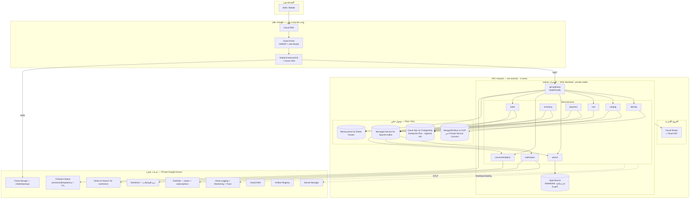
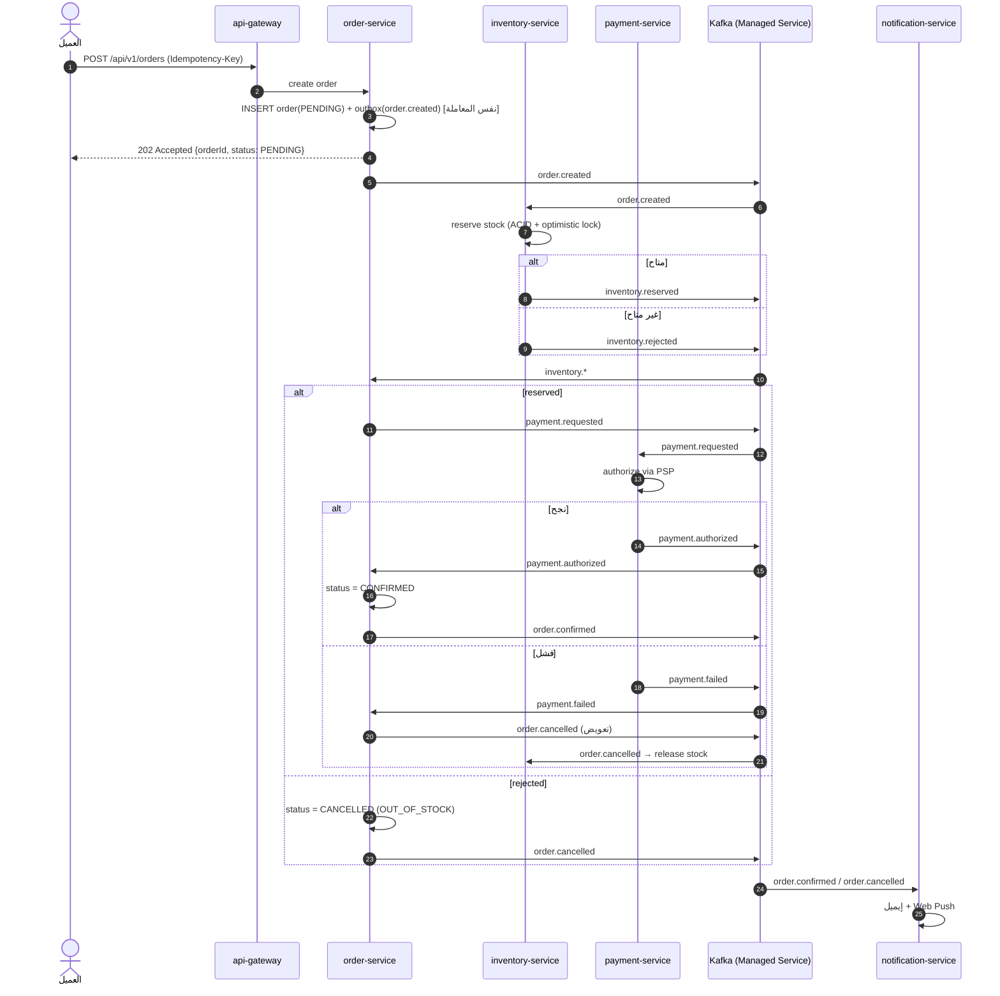
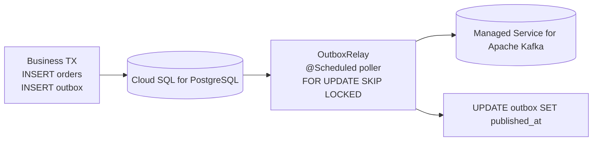
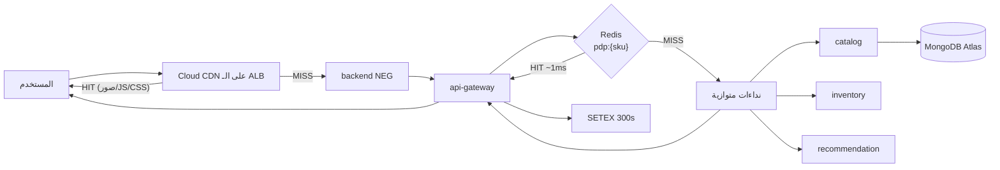
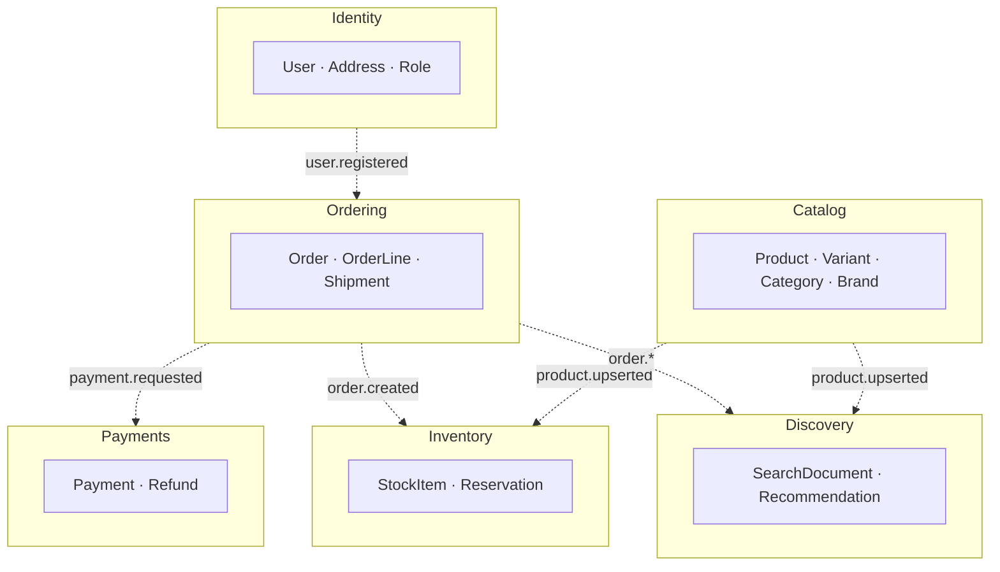

# 01 — معمارية النظام (System Architecture)

## 1. المبادئ التصميمية

| المبدأ | التطبيق |
|---|---|
| **Database per service** | كل خدمة تملك قاعدتها. لا يوجد JOIN عبر الخدمات — التكامل بالأحداث. |
| **Async by default** | كل ما ليس على المسار الحرج للمستخدم يمر عبر Kafka/Pub-Sub. |
| **Stateless services** | الحالة في Cloud SQL/MongoDB Atlas/Memorystore — يسمح بالتوسع الأفقي وبعُقد Spot VMs. |
| **Eventual consistency + Saga** | لا توجد معاملات موزّعة (2PC). Saga مع تعويض (compensation). |
| **Cache-aside** | Redis أمام كل قراءة ساخنة، مع TTL + إبطال بالأحداث. |
| **Idempotency** | كل عملية كتابة عامة تقبل `Idempotency-Key`. |
| **Fail fast + degrade gracefully** | Circuit breakers؛ سقوط التوصيات لا يُسقط صفحة المنتج. |

---

## 2. المخطط العام على Google Cloud

**فرق بنيوي يستحق الانتباه:** الحافة هنا ليست ثلاث طبقات متتالية بل **منتج واحد**. الـ global external Application Load Balancer هو نفسه من يحمل سياسة Cloud Armor ويفعّل Cloud CDN، وهو ليس داخل الـ VPC أصلًا بل عند حافة Google بعنوان anycast عالمي، والخلفيات (backends) هي NEGs تشير إلى الـ pods مباشرة. المكسب: مكوّن أقل نديره ونفوتره، وقفزة شبكة أقل. الثمن: مرونة أقل في ترتيب الطبقات — لا موضع نضع فيه منطقًا مخصّصًا بين فحص الـ WAF وقرار الكاش، إلا عبر Service Extensions وهي أضيق مما نحتاج.

---

## 3. تفصيل الخدمات

### 3.1 `api-gateway` — Node.js / Fastify (BFF)

المهام: التحقق من JWT، التوجيه، rate limiting بـ Redis، تجميع الاستجابات (aggregation) لصفحات الواجهة، ضغط، CORS، ربط `x-request-id`. الـ TLS ينتهي عند الـ global external ALB لا عند الـ gateway؛ الشهادة يديرها Certificate Manager، والحركة من الموازِن إلى الـ pod تمر عبر NEG داخل الـ VPC.

**تمرير الهوية:** الـ gateway يتحقق من التوكن ثم يضيف `X-User-Id` و`X-User-Roles`، ويمرّر `Authorization` كما هو حتى تستطيع خدمة تريد التحقق بنفسها فعل ذلك (`identity-service` تفعل). الكوكيز لا تُمرَّر إطلاقًا — الخدمات الخلفية لا تعرف الجلسات.

نقطة مهمة: صفحة المنتج تحتاج 4 نداءات (product + inventory + reviews + recommendations). الـ BFF يجمعها في نداء واحد `GET /api/v1/bff/pdp/:sku` بالتوازي مع timeout لكل نداء، والتوصيات اختيارية.

### 3.2 `identity-service` — Java / Spring Boot / PostgreSQL

تسجيل، دخول، تدوير Refresh tokens (rotation + reuse detection)، الأدوار، العناوين. كلمات المرور بـ BCrypt. في الإنتاج يمكن استبداله/دمجه مع **Identity Platform** (نفس محرك Firebase Auth بواجهة مؤسسية): يعطينا الدخول الاجتماعي و MFA و SMS OTP جاهزة. لم نبنِ عليه من البداية لأن ربط الأدوار والعناوين بجداولنا يبقى مطلوبًا على أي حال، فالمكسب يقتصر على شاشات التسجيل.

### 3.3 `catalog-service` — Java / Spring Boot / MongoDB

المنتجات كمستندات (variants، attributes متغيّرة حسب القسم — وهو السبب الأساسي لاختيار MongoDB). يبثّ `catalog.product.v1` عند كل تعديل ليُحدِّث الـ search index وليُبطل الكاش. في الإنتاج المخزن هو **MongoDB Atlas على GCP** يُوصَل عبر Private Service Connect — لا يوجد MongoDB مُدار من Google (Firestore ليس متوافقًا مع بروتوكول MongoDB)، فالبديل الوحيد لتفادي مورّد خارجي كان إعادة كتابة الكتالوج على Firestore أو PostgreSQL JSONB، وهو ثمن أكبر من ثمن فاتورة منفصلة.

### 3.4 `inventory-service` — Java / Spring Boot / PostgreSQL

الحقيقة الوحيدة للمخزون. `reserve` / `release` / `commit` بمعاملات ACID و optimistic locking. يستهلك `order.created` ويردّ بـ `inventory.reserved|rejected`.

### 3.5 `order-service` — Java / Spring Boot / PostgreSQL — **Saga Orchestrator**

يملك دورة حياة الطلب وينسّق الـ Saga. يستخدم **Transactional Outbox** لضمان النشر مرة واحدة على الأقل بلا فقد.

### 3.6 `payment-service` — Java / Spring Boot / PostgreSQL

تفويض/تحصيل/استرداد عبر مزوّد (Stripe/Checkout.com/Tabby) خلف واجهة `PaymentGateway`. محليًا: `MockPaymentGateway`.

### 3.7 `cart-service` — Node / Redis

سلة الضيف على `cart:guest:{token}` (TTL 30 يوم) وسلة المستخدم على `cart:user:{id}`. الدمج عند تسجيل الدخول.

### 3.8 `notification-service` — Node

مستهلك Kafka → SendGrid عبر SMTP relay (إيميل) / Pub/Sub (fan-out و SMS) / Web Push. Retry مع backoff ثم dead-letter topic.

الإيميل هو الثغرة الوحيدة في تغطية المنصة: **لا تملك Google Cloud خدمة بريد صادر أصلًا**، ولا حتى واجهة SMTP مُدارة. لذلك المزوّد خارجي (SendGrid)، وثمن ذلك ملموس: سرّ إضافي في Secret Manager، سجلات SPF و DKIM و DMARC في Cloud DNS، سمعة IP لا نتحكم بها، وفاتورة خارج فاتورة Google Cloud ما لم نشترِ عبر Marketplace.

### 3.9 `search-service` — Python / FastAPI / OpenSearch

بحث نصي عربي/إنجليزي، facets ديناميكية، فرز، autocomplete، مزامنة الفهرس من Kafka.

هذه الخدمة الوحيدة التي تحمل عبئًا تشغيليًا حقيقيًا بعد الانتقال: **لا يوجد OpenSearch مُدار على Google Cloud**، فالعنقود يعمل كـ StatefulSet داخل GKE على أقراص Persistent Disk، ونحن من يملك الترقيات و snapshots وإعادة توزيع الـ shards وضبط الـ JVM.

### 3.10 `recommendation-service` — Python / FastAPI / Vertex AI Search for commerce

ثلاثة نماذج تقديم (serving configs) عبر Retail API: `recommended-for-you` على الصفحة الرئيسية، `similar-items` في صفحة المنتج، و`search` مع التخصيص لإعادة ترتيب نتائج البحث لكل مستخدم. التفاعلات تُبَثّ كـ user events إلى نفس الكتالوج، والكتالوج نفسه يُستورد من Cloud Storage.

ملاحظتان عمليتان: كتالوج التجزئة يسكن `global` لا إقليم الحوسبة — لا وجود لكتالوج إقليمي في `me-central1` يمكن الإشارة إليه. وعند فراغ أي serving config تسقط الخدمة تلقائيًا إلى ترتيب شعبية محسوب من Redis، وهو ما يبقيها صالحة في اليوم الأول قبل أن يتدرّب النموذج أصلًا.

---

## 4. تدفق إنشاء الطلب (Order Saga)

### خطوات التعويض (Compensation)

| الخطوة | التعويض |
|---|---|
| حجز المخزون | `inventory.release` عند `order.cancelled` |
| تفويض الدفع | `payment.void` / `payment.refund` |
| نقاط الولاء | عكس القيد |

**كل معالج أحداث idempotent**: جدول `processed_events(event_id PK)` يمنع التكرار عند إعادة التسليم.

---

## 5. نمط Transactional Outbox

بديلان للإنتاج، وكلاهما بثمن:

- **Debezium** يقرأ WAL بدل الـ polling. لكن عمّال Kafka Connect هنا مسؤوليتنا: نشغّلهم على GKE أو على Connect cluster المصاحب لخدمة Kafka المُدارة حيث يتوفّر. أي أننا نستبدل تكلفة الـ polling بمكوّن حالته الداخلية (offsets، schema history) صار علينا حراستها.
- **Datastream** — خدمة CDC المُدارة من Google. تقرأ WAL من Cloud SQL بلا بنية نديرها، لكنها **لا تكتب إلى Kafka**: وجهاتها BigQuery و Cloud Storage. ممتازة للتحليلات، عديمة الفائدة كناقل للـ Saga.

لذلك بقي الـ polling هو الافتراضي: `FOR UPDATE SKIP LOCKED` على جدول صغير مفهرَس تكلفته معروفة ومحدودة، ولا يضيف مكوّنًا جديدًا إلى ما نحن مسؤولون عن إبقائه حيًّا.

---

## 6. تدفق قراءة صفحة المنتج (Read Path)

**طبقات الـ Cache:**

1. المتصفح (`Cache-Control`)
2. Cloud CDN (الأصول الثابتة + استجابات GET العامة)
3. Next.js ISR / `revalidate`
4. Redis في الـ gateway (استجابات مجمّعة)
5. Redis داخل الخدمة (كيانات مفردة)
6. Read replicas في Cloud SQL

الطبقة الثانية تغيّر سلوكها قليلًا بعد الانتقال: إبطال الكاش في Cloud CDN (`invalidate-cdn-cache`) محكوم بحصة صارمة على عدد الطلبات في الدقيقة، فلا يصلح آليةً أساسية كما كان `CreateInvalidation`. لذلك نعتمد أولًا على مسارات مُوسومة بالإصدار للأصول الثابتة، وعلى TTL قصير مع `stale-while-revalidate` للاستجابات العامة، ونُبقي الإبطال الصريح للحالات النادرة (سحب منتج، تصحيح سعر خاطئ).

---

## 7. حدود السياق (Bounded Contexts)

القاعدة: **لا نداء متزامن بين خدمتي مجال (domain services)** إلا في حالتين مبرّرتين (order → inventory عند الـ checkout المتزامن الاختياري). التكامل الافتراضي بالأحداث.

---

## 8. قرارات مفتاحية

| القرار | البديل المرفوض | السبب |
|---|---|---|
| Kafka المُدار كناقل رئيسي | Pub/Sub وحده | Pub/Sub يعرف الاستعادة بـ seek وretention، لكنه ليس سجلًا مضغوطًا (log compaction) ولا يعطينا offsets صريحة لكل مجموعة — وإعادة بناء الفهرس من أول الزمن تحتاج سجلًا لا طابورًا |
| MongoDB Atlas للكتالوج | Firestore أو PostgreSQL JSONB | مخطط المنتج يختلف جذريًا بين الأقسام + قراءات مستندية + الكود قائم أصلًا على استعلامات MongoDB |
| Cloud SQL للطلبات/الدفع | Firestore | معاملات ACID ومتطلبات محاسبية |
| OpenSearch على GKE | Vertex AI Search وحده للبحث | نحتاج facets دقيقة وتحكمًا في BM25 والتحليل الصرفي العربي — والـ Retail API صندوق مغلق نسبيًا |
| Saga مُنسَّقة (orchestration) | Choreography | تتبّع أوضح لحالة الطلب وأسهل في التشخيص |
| BFF منفصل | نداء مباشر من المتصفح | تقليل عدد الرحلات + إخفاء التفاصيل الداخلية |
