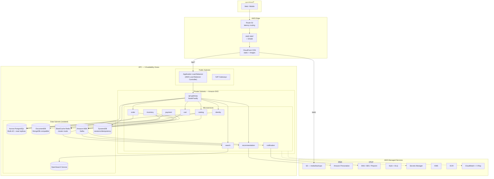
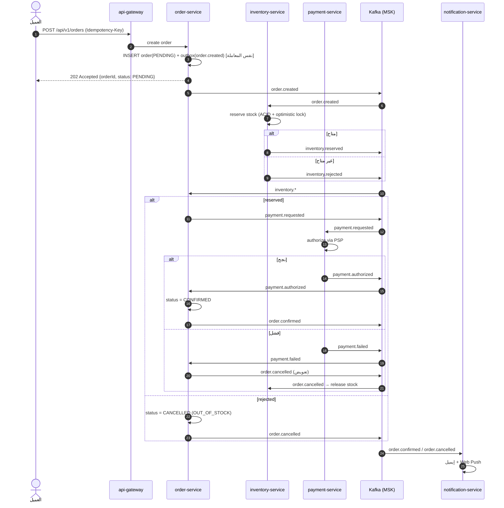
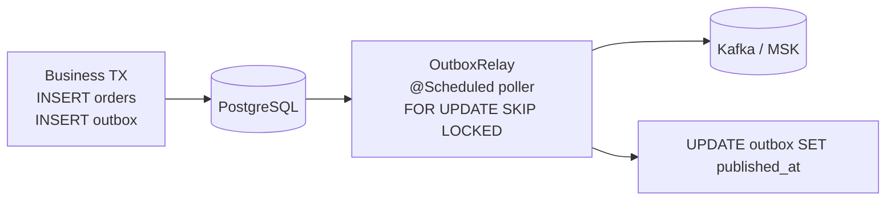
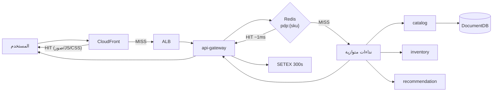

# 01 — معمارية النظام (System Architecture)

## 1. المبادئ التصميمية

| المبدأ | التطبيق |
|---|---|
| **Database per service** | كل خدمة تملك قاعدتها. لا يوجد JOIN عبر الخدمات — التكامل بالأحداث. |
| **Async by default** | كل ما ليس على المسار الحرج للمستخدم يمر عبر Kafka/SQS. |
| **Stateless services** | الحالة في RDS/DocumentDB/ElastiCache — يسمح بالتوسع الأفقي والـ spot instances. |
| **Eventual consistency + Saga** | لا توجد معاملات موزّعة (2PC). Saga مع تعويض (compensation). |
| **Cache-aside** | Redis أمام كل قراءة ساخنة، مع TTL + إبطال بالأحداث. |
| **Idempotency** | كل عملية كتابة عامة تقبل `Idempotency-Key`. |
| **Fail fast + degrade gracefully** | Circuit breakers؛ سقوط التوصيات لا يُسقط صفحة المنتج. |

---

## 2. المخطط العام على AWS



---

## 3. تفصيل الخدمات

### 3.1 `api-gateway` — Node.js / Fastify (BFF)

المهام: TLS termination خلف ALB، التحقق من JWT، التوجيه، rate limiting بـ Redis، تجميع الاستجابات (aggregation) لصفحات الواجهة، ضغط، CORS، ربط `x-request-id`.

**تمرير الهوية:** الـ gateway يتحقق من التوكن ثم يضيف `X-User-Id` و`X-User-Roles`، ويمرّر `Authorization` كما هو حتى تستطيع خدمة تريد التحقق بنفسها فعل ذلك (`identity-service` تفعل). الكوكيز لا تُمرَّر إطلاقًا — الخدمات الخلفية لا تعرف الجلسات.

نقطة مهمة: صفحة المنتج تحتاج 4 نداءات (product + inventory + reviews + recommendations). الـ BFF يجمعها في نداء واحد `GET /api/v1/bff/pdp/:sku` بالتوازي مع timeout لكل نداء، والتوصيات اختيارية.

### 3.2 `identity-service` — Java / Spring Boot / PostgreSQL

تسجيل، دخول، تدوير Refresh tokens (rotation + reuse detection)، الأدوار، العناوين. كلمات المرور بـ BCrypt. في الإنتاج يمكن استبداله/دمجه مع **Amazon Cognito**.

### 3.3 `catalog-service` — Java / Spring Boot / MongoDB

المنتجات كمستندات (variants، attributes متغيّرة حسب القسم — وهو السبب الأساسي لاختيار MongoDB). يبثّ `catalog.product.v1` عند كل تعديل ليُحدِّث الـ search index والـ CDN invalidation.

### 3.4 `inventory-service` — Java / Spring Boot / PostgreSQL

الحقيقة الوحيدة للمخزون. `reserve` / `release` / `commit` بمعاملات ACID و optimistic locking. يستهلك `order.created` ويردّ بـ `inventory.reserved|rejected`.

### 3.5 `order-service` — Java / Spring Boot / PostgreSQL — **Saga Orchestrator**

يملك دورة حياة الطلب وينسّق الـ Saga. يستخدم **Transactional Outbox** لضمان النشر مرة واحدة على الأقل بلا فقد.

### 3.6 `payment-service` — Java / Spring Boot / PostgreSQL

تفويض/تحصيل/استرداد عبر مزوّد (Stripe/Checkout.com/Tabby) خلف واجهة `PaymentGateway`. محليًا: `MockPaymentGateway`.

### 3.7 `cart-service` — Node / Redis

سلة الضيف على `cart:guest:{token}` (TTL 30 يوم) وسلة المستخدم على `cart:user:{id}`. الدمج عند تسجيل الدخول.

### 3.8 `notification-service` — Node

مستهلك Kafka → SES (إيميل) / SNS / Web Push. Retry مع backoff ثم DLQ.

### 3.9 `search-service` — Python / FastAPI / OpenSearch

بحث نصي عربي/إنجليزي، facets ديناميكية، فرز، autocomplete، مزامنة الفهرس من Kafka.

### 3.10 `recommendation-service` — Python / FastAPI / Amazon Personalize

ثلاثة استخدامات: `recommended-for-you` (USER_PERSONALIZATION)، `bought-together` (RELATED_ITEMS)، `personalized-ranking`. عند غياب الـ campaign ARN يسقط تلقائيًا إلى ترتيب شعبية محسوب من Redis.

---

## 4. تدفق إنشاء الطلب (Order Saga)



### خطوات التعويض (Compensation)

| الخطوة | التعويض |
|---|---|
| حجز المخزون | `inventory.release` عند `order.cancelled` |
| تفويض الدفع | `payment.void` / `payment.refund` |
| نقاط الولاء | عكس القيد |

**كل معالج أحداث idempotent**: جدول `processed_events(event_id PK)` يمنع التكرار عند إعادة التسليم.

---

## 5. نمط Transactional Outbox



بديل جاهز للإنتاج: **Debezium** على MSK Connect يقرأ WAL بدل الـ polling.

---

## 6. تدفق قراءة صفحة المنتج (Read Path)



**طبقات الـ Cache:**

1. المتصفح (`Cache-Control`)
2. CloudFront (الأصول الثابتة + استجابات GET العامة)
3. Next.js ISR / `revalidate`
4. Redis في الـ gateway (استجابات مجمّعة)
5. Redis داخل الخدمة (كيانات مفردة)
6. Read replicas في Aurora

---

## 7. حدود السياق (Bounded Contexts)

```mermaid
flowchart TB
    subgraph Identity
        U["User · Address · Role"]
    end
    subgraph Catalog
        P["Product · Variant · Category · Brand"]
    end
    subgraph Inventory
        S["StockItem · Reservation"]
    end
    subgraph Ordering
        O["Order · OrderLine · Shipment"]
    end
    subgraph Payments
        Pay["Payment · Refund"]
    end
    subgraph Discovery
        Se["SearchDocument · Recommendation"]
    end

    Catalog -.product.upserted.-> Discovery
    Catalog -.product.upserted.-> Inventory
    Ordering -.order.created.-> Inventory
    Ordering -.payment.requested.-> Payments
    Ordering -.order.*.-> Discovery
    Identity -.user.registered.-> Ordering
```

القاعدة: **لا نداء متزامن بين خدمتي مجال (domain services)** إلا في حالتين مبرّرتين (order → inventory عند الـ checkout المتزامن الاختياري). التكامل الافتراضي بالأحداث.

---

## 8. قرارات مفتاحية

| القرار | البديل المرفوض | السبب |
|---|---|---|
| Kafka/MSK كناقل رئيسي | SQS فقط | نحتاج إعادة تشغيل الأحداث (replay) لبناء الفهرس والتوصيات |
| MongoDB للكتالوج | PostgreSQL JSONB | مخطط المنتج يختلف جذريًا بين الأقسام + قراءات مستندية |
| PostgreSQL للطلبات/الدفع | MongoDB | معاملات ACID ومتطلبات محاسبية |
| Saga مُنسَّقة (orchestration) | Choreography | تتبّع أوضح لحالة الطلب وأسهل في التشخيص |
| BFF منفصل | نداء مباشر من المتصفح | تقليل عدد الرحلات + إخفاء التفاصيل الداخلية |
