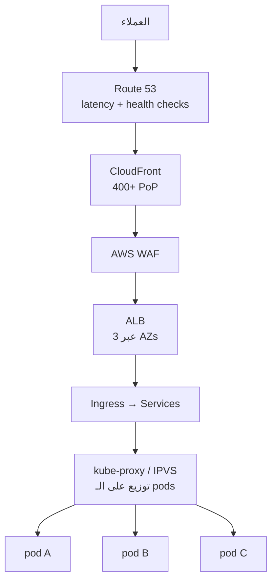
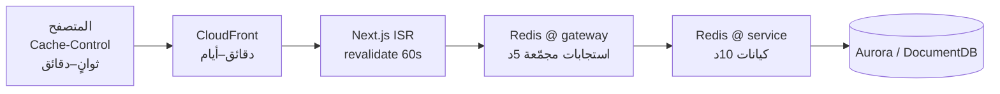

# 04 — التوسّع، موازنة الحمل، والصمود

## 1. الأهداف (SLOs)

| المقياس | الهدف |
|---|---|
| توفر الواجهة | 99.95% |
| p95 صفحة المنتج (API) | < 200 ms |
| p95 البحث | < 300 ms |
| p95 إنشاء طلب (قبول 202) | < 400 ms |
| ذروة الطلبات (Black Friday / White Friday) | 20× المعدل الطبيعي |
| RPO / RTO | 5 دقائق / 30 دقيقة |

---

## 2. طبقات موازنة الحمل



| الطبقة | الآلية |
|---|---|
| DNS | Route 53 latency-based + failover |
| Edge | CloudFront يخدم ~85% من الطلبات دون لمس الأصل |
| L7 | ALB — least outstanding requests، cross-zone، sticky للـ checkout فقط |
| Cluster | Kubernetes Service (IPVS) + `topologyAwareRouting` لتقليل عبور الـ AZ |
| DB | RDS Proxy + توجيه القراءات إلى read replicas |

---

## 3. التوسع التلقائي

### 3.1 على مستوى الـ Pods — HPA

```yaml
metrics:
  - type: Resource
    resource: { name: cpu, target: { type: Utilization, averageUtilization: 65 } }
  - type: Pods
    pods:
      metric: { name: http_requests_per_second }
      target: { type: AverageValue, averageValue: "120" }
behavior:
  scaleUp:   { stabilizationWindowSeconds: 0,   policies: [{ type: Percent, value: 100, periodSeconds: 30 }] }
  scaleDown: { stabilizationWindowSeconds: 300, policies: [{ type: Percent, value: 20,  periodSeconds: 60 }] }
```

الصعود سريع والهبوط بطيء — تجنّبًا للـ thrashing.

### 3.2 التوسع بعمق الطابور — KEDA

المستهلكون (notification، search-indexer) يتوسعون بـ **consumer lag** في Kafka وليس بالـ CPU:

```yaml
triggers:
  - type: kafka
    metadata:
      bootstrapServers: msk-broker:9092
      consumerGroup: notification-service
      topic: order.events.v1
      lagThreshold: "500"
```

### 3.3 على مستوى العُقد — Karpenter

```yaml
requirements:
  - { key: karpenter.sh/capacity-type, operator: In, values: ["spot", "on-demand"] }
  - { key: kubernetes.io/arch,          operator: In, values: ["arm64"] }
  - { key: node.kubernetes.io/instance-type, operator: In,
      values: ["m7g.large","m7g.xlarge","c7g.large","c7g.xlarge","r7g.large"] }
disruption:
  consolidationPolicy: WhenEmptyOrUnderutilized
```

تنوّع أنواع الـ instances يقلّل احتمال سحب الـ Spot دفعة واحدة. الخدمات الحساسة (order, payment) على On-Demand عبر `nodeSelector`.

### 3.4 قواعد البيانات

| المخزن | التوسع |
|---|---|
| Aurora | writer عمودي + **Auto Scaling** لعدد الـ read replicas (2→15) |
| DocumentDB | إضافة replicas للقراءة |
| ElastiCache | Cluster mode — إضافة shards + resharding أونلاين |
| MSK | زيادة الـ brokers + إعادة توزيع الأقسام (partition reassignment) |
| OpenSearch | إضافة data nodes + زيادة الـ replicas وقت الذروة |
| DynamoDB | On-Demand — بلا إدارة |

---

## 4. استراتيجية الـ Caching



**سياسة الإبطال:** حدث `catalog.product.upserted` ⇒ حذف `product:{sku}` و `pdp:{sku}:*` من Redis + `CreateInvalidation` على CloudFront للمسار المتأثر فقط.

**مشاكل معروفة وحلولها:**

| المشكلة | الحل |
|---|---|
| Cache stampede | قفل `SET NX` + إعادة بناء واحدة (single-flight) |
| Thundering herd بعد النشر | تسخين مسبق (cache warming) لأفضل 1000 منتج |
| Hot key (منتج فيروسي) | نسخة محلية داخل الـ pod (L1) بـ TTL 5s فوق Redis |
| بيانات قديمة | TTL قصير + إبطال بالأحداث + `stale-while-revalidate` |

---

## 5. الصمود (Resilience)

### 5.1 Circuit Breaker — Resilience4j (Java)

```yaml
resilience4j.circuitbreaker.instances.recommendation:
  slidingWindowSize: 50
  failureRateThreshold: 50
  waitDurationInOpenState: 20s
  permittedNumberOfCallsInHalfOpenState: 5
resilience4j.timelimiter.instances.recommendation:
  timeoutDuration: 400ms
```

### 5.2 تدهور متدرّج (Graceful Degradation)

| العطل | السلوك |
|---|---|
| سقوط recommendation | صفحة المنتج تُعرض بدون قسم «مقترح لك» |
| سقوط search | fallback إلى تصفح الأقسام من MongoDB |
| سقوط Redis | القراءة مباشرة من قاعدة البيانات (أبطأ لكن يعمل) |
| سقوط payment | الطلب يبقى `AWAITING_PAYMENT` وتُعاد المحاولة لاحقًا |
| سقوط inventory | رفض إنشاء طلبات جديدة — **لا نبيع ما لا نملك** (fail closed) |

القاعدة: مسارات القراءة **fail open**، مسارات المال والمخزون **fail closed**.

### 5.3 Bulkheads

thread pools / connection pools منفصلة لكل تبعية خارجية حتى لا يستهلك تباطؤ خدمة واحدة كل الاتصالات.

### 5.4 إعادة المحاولة

exponential backoff + **jitter**، وحد أقصى 3 محاولات، وفقط للعمليات الـ idempotent. كل consumer له DLQ.

### 5.5 Health probes

```yaml
startupProbe:   { httpGet: { path: /health/live,  port: 8080 }, failureThreshold: 30, periodSeconds: 5 }
livenessProbe:  { httpGet: { path: /health/live,  port: 8080 }, periodSeconds: 10 }
readinessProbe: { httpGet: { path: /health/ready, port: 8080 }, periodSeconds: 5 }
```

`ready` يفحص التبعيات الحرجة فقط. `live` لا يفحص التبعيات إطلاقًا — وإلا سقوط قاعدة البيانات يقتل كل الـ pods.

### 5.6 PodDisruptionBudget + anti-affinity

```yaml
minAvailable: 60%
topologySpreadConstraints:
  - maxSkew: 1
    topologyKey: topology.kubernetes.io/zone
    whenUnsatisfiable: ScheduleAnyway
```

---

## 6. التعامل مع الذروة (White Friday)

| الأسلوب | التفصيل |
|---|---|
| Pre-scaling | رفع `minReplicas` والعُقد قبل الحدث بـ 24 ساعة |
| Queue-based leveling | الـ checkout يُقبل بـ `202` ويُعالج غير متزامن — الحِمل يستوعبه Kafka |
| Virtual waiting room | CloudFront Function + Lambda@Edge لتوزيع الدخول عند تجاوز حد معيّن |
| Read-only mode | تعطيل الكتابات غير الحرجة (مراجعات، قوائم رغبات) |
| Shed load | رفض `429` للـ bots والزحف عبر WAF |
| تسخين الكاش | تحميل أفضل 10 آلاف منتج إلى Redis وCloudFront مسبقًا |
| اختبار حِمل | k6 على بيئة مطابقة قبل الحدث بأسبوعين |

---

## 7. تعدد المناطق (Multi-Region)

المرحلة 1 — **Active/Passive**: منطقة رئيسية `me-south-1` (البحرين) + `me-central-1` (الإمارات) كاحتياطي، مع Aurora Global Database (RPO < 1 ثانية) و DynamoDB Global Tables و S3 CRR، والتحويل عبر Route 53 health checks.

المرحلة 2 — **Active/Active** للقراءة: CloudFront + قراءات محلية من replicas، والكتابات موجّهة للمنطقة الرئيسية.

---

## 8. الأداء داخل الكود

| البند | القاعدة |
|---|---|
| N+1 queries | `IN (...)` batch أو DataLoader في الـ BFF |
| Payloads | حقول مطلوبة فقط (projection) — لا `SELECT *` |
| Connection pools | HikariCP: `maximumPoolSize = ((cores × 2) + effective_spindles)`، وRDS Proxy فوقها |
| JVM | Java 21 + **Virtual Threads** + `-XX:+UseZGC` للـ latency المنخفض |
| Node | Fastify (أسرع ~2× من Express)، `undici` للـ HTTP، keep-alive agents |
| Python | `uvicorn` + `uvloop`، `httpx.AsyncClient` مشترك |
| الصور | WebP/AVIF عبر CloudFront + Lambda@Edge، `srcset` متجاوب |
| الواجهة | RSC، code splitting، `next/image`، preconnect للـ CDN |
