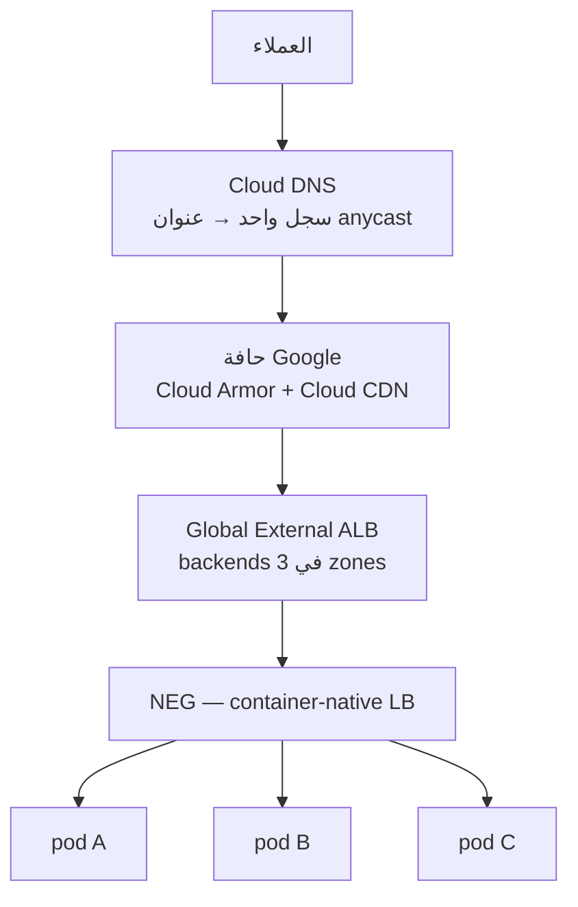
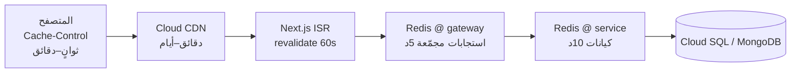

# 04 — التوسّع، موازنة الحمل، والصمود

## 1. الأهداف (SLOs)

| المقياس | الهدف |
|---|---|
| توفر الواجهة | 99.95% |
| p95 صفحة المنتج (API) | < 200 ms |
| p95 البحث | < 300 ms |
| p95 إنشاء طلب (قبول 202) | < 400 ms |
| ذروة الطلبات (Black Friday / White Friday) | 20× المعدل الطبيعي |
| RPO / RTO | 5 دقائق / 30 دقيقة |

---

## 2. طبقات موازنة الحمل



| الطبقة | الآلية |
|---|---|
| DNS | Cloud DNS — سجل A واحد إلى عنوان anycast عالمي. لا توجيه حسب زمن الاستجابة ولا حاجة إليه: الاختيار يحدث في شبكة Google لا في مُحلِّل العميل |
| Edge | Cloud CDN يخدم ~85% من الطلبات دون لمس الأصل، وCloud Armor يفحص قبل ذلك — كلاهما على نفس الـ forwarding rule |
| L7 | الموازِن العالمي — `RATE` أو `UTILIZATION` كوضع موازنة، تصريف تلقائي إلى المنطقة التالية عند التشبّع، و session affinity للـ checkout فقط |
| Cluster | **لا قفزة `kube-proxy`.** الـ NEG يحمل عناوين الـ pods نفسها، فالموازِن يصل إلى الحاوية مباشرة. مكسب مزدوج: قفزة شبكة أقل، وفحوص صحية على الـ pod الحقيقي لا على العُقدة |
| داخل العنقود | GKE Dataplane V2 (eBPF) للحركة بين الخدمات + `topologyAwareRouting` لتقليل عبور النطاقات |
| DB | Cloud SQL Auth Proxy — نفق مصادَق، **لا مجمِّع اتصالات** — وتوجيه القراءات إلى read replicas عبر اسم مضيف منفصل |

**الفرق الأهم عن التصميم السابق:** الطبقات الثلاث الأولى كانت ثلاثة منتجات وثلاث قفزات؛ صارت منتجًا واحدًا وقفزة واحدة عند حافة Google. الطبقة الرابعة اختفت تمامًا — لم يعد هناك موازِن داخل الشبكة يوزّع على العُقد ثم `kube-proxy` يوزّع على الـ pods. عمليًا هذا يحذف **قفزتين** من مسار كل طلب.

---

## 3. التوسع التلقائي

### 3.1 على مستوى الـ Pods — HPA

```yaml
metrics:
  - type: Resource
    resource: { name: cpu, target: { type: Utilization, averageUtilization: 65 } }
  - type: Pods
    pods:
      metric: { name: http_requests_per_second }
      target: { type: AverageValue, averageValue: "120" }
behavior:
  scaleUp:   { stabilizationWindowSeconds: 0,   policies: [{ type: Percent, value: 100, periodSeconds: 30 }] }
  scaleDown: { stabilizationWindowSeconds: 300, policies: [{ type: Percent, value: 20,  periodSeconds: 60 }] }
```

الصعود سريع والهبوط بطيء — تجنّبًا للـ thrashing.

### 3.2 التوسع بعمق الطابور — KEDA

المستهلكون (notification، search-indexer) يتوسعون بـ **consumer lag** في Kafka وليس بالـ CPU:

```yaml
triggers:
  - type: kafka
    metadata:
      bootstrapServers: bootstrap.topchoice-prod-kafka.me-central1.managedkafka.topchoice-prod.cloud.goog:9092
      consumerGroup: notification-service
      topic: order.events.v1
      lagThreshold: "500"
```

### 3.3 على مستوى العُقد — التوفير التلقائي في GKE

```yaml
# cluster_autoscaling في gke.tf — يُنشئ مجمّع العقد بالشكل المناسب عند الحاجة
autoProvisioningDefaults:
  diskType: pd-balanced
  shieldedInstanceConfig: { enableSecureBoot: true }
  management: { autoRepair: true, autoUpgrade: true }
resourceLimits:
  - { resourceType: cpu,    minimum: 1, maximum: 128 }
  - { resourceType: memory, minimum: 1, maximum: 512 }
```

بديل Karpenter على GKE. الفرق العملي أن GKE لا يحتاج تعداد أنواع الآلات
مسبقًا: يستنتج الشكل المناسب من طلبات الـ Pod المعلّق ويُنشئ مجمّعًا له.

مجمّع Spot موسوم بـ `cloud.google.com/gke-spot`، والوسم يُجبر الأحمال على إعلان
تحمّلها للإخلاء صراحةً — فلا يهبط StatefulSet هناك بالخطأ. الخدمات الحسّاسة
(order، payment) تبقى على المجمّع العادي لأنها لا تتحمّل إشعار إخلاء مدته ثلاثون
ثانية في منتصف Saga.

### 3.4 قواعد البيانات

| المخزن | التوسع |
|---|---|
| Cloud SQL | ترقية الفئة عموديًا + نسخ قارئة (حتى ٨) + توسيع القرص تلقائيًا |
| MongoDB Atlas | ترقية الفئة + أجزاء للقراءة |
| Memorystore | Redis Cluster — زيادة الأجزاء وإعادة التوزيع أونلاين |
| Managed Kafka | زيادة vCPU والذاكرة + إعادة توازن تلقائية عند التوسّع |
| OpenSearch | زيادة نسخ الـ StatefulSet + زيادة النسخ المتماثلة وقت الذروة |
| Firestore | يتوسّع تلقائيًا — بلا إدارة سعة إطلاقًا |

---

## 4. استراتيجية الـ Caching



**سياسة الإبطال:** حدث `catalog.product.upserted` ⇒ حذف `product:{sku}` و `pdp:{sku}:*` من Redis + `gcloud compute url-maps invalidate-cdn-cache` للمسار المتأثر فقط.

**مشاكل معروفة وحلولها:**

| المشكلة | الحل |
|---|---|
| Cache stampede | قفل `SET NX` + إعادة بناء واحدة (single-flight) |
| Thundering herd بعد النشر | تسخين مسبق (cache warming) لأفضل 1000 منتج |
| Hot key (منتج فيروسي) | نسخة محلية داخل الـ pod (L1) بـ TTL 5s فوق Redis |
| بيانات قديمة | TTL قصير + إبطال بالأحداث + `stale-while-revalidate` |

---

## 5. الصمود (Resilience)

### 5.1 Circuit Breaker — Resilience4j (Java)

```yaml
resilience4j.circuitbreaker.instances.recommendation:
  slidingWindowSize: 50
  failureRateThreshold: 50
  waitDurationInOpenState: 20s
  permittedNumberOfCallsInHalfOpenState: 5
resilience4j.timelimiter.instances.recommendation:
  timeoutDuration: 400ms
```

### 5.2 تدهور متدرّج (Graceful Degradation)

| العطل | السلوك |
|---|---|
| سقوط recommendation | صفحة المنتج تُعرض بدون قسم «مقترح لك» |
| سقوط search | fallback إلى تصفح الأقسام من MongoDB |
| سقوط Redis | القراءة مباشرة من قاعدة البيانات (أبطأ لكن يعمل) |
| سقوط payment | الطلب يبقى `AWAITING_PAYMENT` وتُعاد المحاولة لاحقًا |
| سقوط inventory | رفض إنشاء طلبات جديدة — **لا نبيع ما لا نملك** (fail closed) |

القاعدة: مسارات القراءة **fail open**، مسارات المال والمخزون **fail closed**.

### 5.3 Bulkheads

thread pools / connection pools منفصلة لكل تبعية خارجية حتى لا يستهلك تباطؤ خدمة واحدة كل الاتصالات.

### 5.4 إعادة المحاولة

exponential backoff + **jitter**، وحد أقصى 3 محاولات، وفقط للعمليات الـ idempotent. كل consumer له DLQ.

### 5.5 Health probes

```yaml
startupProbe:   { httpGet: { path: /health/live,  port: 8080 }, failureThreshold: 30, periodSeconds: 5 }
livenessProbe:  { httpGet: { path: /health/live,  port: 8080 }, periodSeconds: 10 }
readinessProbe: { httpGet: { path: /health/ready, port: 8080 }, periodSeconds: 5 }
```

`ready` يفحص التبعيات الحرجة فقط. `live` لا يفحص التبعيات إطلاقًا — وإلا سقوط قاعدة البيانات يقتل كل الـ pods.

### 5.6 PodDisruptionBudget + anti-affinity

```yaml
minAvailable: 60%
topologySpreadConstraints:
  - maxSkew: 1
    topologyKey: topology.kubernetes.io/zone
    whenUnsatisfiable: ScheduleAnyway
```

---

## 6. التعامل مع الذروة (White Friday)

| الأسلوب | التفصيل |
|---|---|
| Pre-scaling | رفع `minReplicas` والعُقد قبل الحدث بـ 24 ساعة |
| Queue-based leveling | الـ checkout يُقبل بـ `202` ويُعالج غير متزامن — الحِمل يستوعبه Kafka |
| Virtual waiting room | Cloud Armor rate-based ban + صفحة انتظار على موازن الحمل عند تجاوز حد معيّن |
| Read-only mode | تعطيل الكتابات غير الحرجة (مراجعات، قوائم رغبات) |
| Shed load | رفض `429` للـ bots والزحف عبر Cloud Armor |
| تسخين الكاش | تحميل أفضل 10 آلاف منتج إلى Redis وCloud CDN مسبقًا |
| اختبار حِمل | k6 على بيئة مطابقة قبل الحدث بأسبوعين |

---

## 7. تعدد المناطق (Multi-Region)

المرحلة 1 — **Active/Passive**: منطقة رئيسية `me-central1` (الدوحة) + `europe-southwest1` (مدريد) كاحتياطي، مع نسخة Cloud SQL قارئة عابرة للمناطق (RPO بالثواني) و Firestore متعدد المناطق أصلًا و Cloud Storage بنسخ ثنائي المنطقة، والتحويل عبر فحوص صحة موازن الحمل العالمي.

> عنوان anycast واحد يبسّط هذه المرحلة كثيرًا مقارنةً بـ AWS: لا نحتاج تبديل سجلات DNS ولا انتظار انتهاء صلاحيتها في محلّلات الأسماء — موازن الحمل نفسه يوجّه إلى المنطقة السليمة.

المرحلة 2 — **Active/Active** للقراءة: Cloud CDN + قراءات محلية من النسخ القارئة، والكتابات موجّهة للمنطقة الرئيسية.

---

## 8. الأداء داخل الكود

| البند | القاعدة |
|---|---|
| N+1 queries | `IN (...)` batch أو DataLoader في الـ BFF |
| Payloads | حقول مطلوبة فقط (projection) — لا `SELECT *` |
| Connection pools | HikariCP: `maximumPoolSize = ((cores × 2) + effective_spindles)`، وCloud SQL Auth Proxy فوقها |
| JVM | Java 21 + **Virtual Threads** + `-XX:+UseZGC` للـ latency المنخفض |
| Node | Fastify (أسرع ~2× من Express)، `undici` للـ HTTP، keep-alive agents |
| Python | `uvicorn` + `uvloop`، `httpx.AsyncClient` مشترك |
| الصور | WebP/AVIF عبر Cloud CDN مع الضغط التلقائي، `srcset` متجاوب |
| الواجهة | RSC، code splitting، `next/image`، preconnect للـ CDN |
