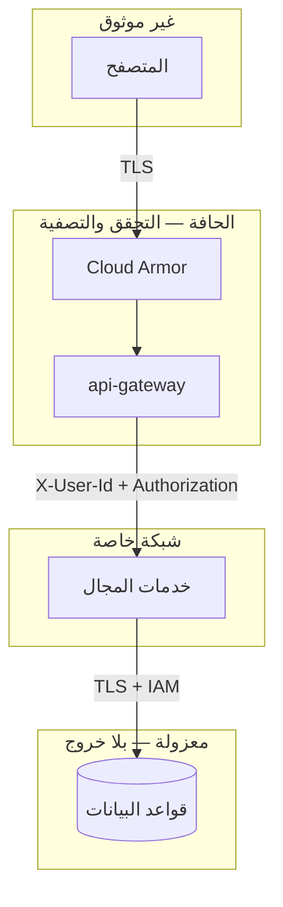
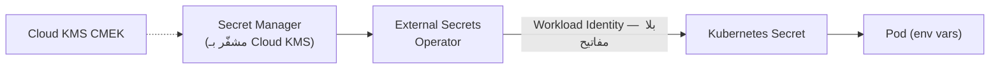

# 07 — الأمان

## 1. نموذج التهديد المختصر

| الأصل | التهديد | الضابط |
|---|---|---|
| حسابات المستخدمين | حشو بيانات الاعتماد | BCrypt · حد معدّل في Cloud Armor · قفل تدريجي |
| توكنات الجلسة | سرقة وإعادة استخدام | TTL قصير · تدوير Refresh + كشف إعادة الاستخدام |
| بيانات الدفع | تسريب بيانات البطاقات | **لا نخزّنها إطلاقًا** — tokenization لدى المزوّد |
| الأسعار | تلاعب العميل بالسعر | السعر يُقرأ من الكتالوج على الخادم |
| المخزون | حجز خبيث/تكرار | idempotency · TTL للحجز · حدود الكمية |
| قواعد البيانات | وصول مباشر | شبكات معزولة · قواعد جدار ناري على حسابات الخدمة · بلا مسار خروج |
| الأسرار | تسريب في Git | Secret Manager + Workload Identity — لا سرّ في المستودع |
| بيانات اعتماد العقدة | SSRF لسرقة خادم البيانات الوصفية | Workload Identity يحجب توكن العقدة عن الـ pods · حجب `169.254.169.254` في NetworkPolicy |

---

## 2. المصادقة والتفويض

### 2.1 كلمات المرور

BCrypt بتكلفة 10. عند فشل تسجيل الدخول نُشغّل مقارنة وهمية بهاش ثابت — بلا ذلك يكشف فرق التوقيت أي بريد مسجّل وأيّه لا:

```java
// services/identity-service/.../AuthService.java
if (maybeUser.isEmpty()) {
    encoder.matches(req.password(), DUMMY_HASH);   // زمن ثابت
    throw ApiException.unauthorized("INVALID_CREDENTIALS", "Invalid email or password");
}
```

### 2.2 التوكنات

| النوع | العمر | التخزين | الإبطال |
|---|---|---|---|
| Access (JWT) | 15 دقيقة | ذاكرة العميل | لا — ينتهي وحده |
| Refresh (opaque) | 30 يومًا | جدول، مخزَّن كـ SHA-256 | فوري |

**تدوير مع كشف إعادة الاستخدام:** كل تحديث يُبطل التوكن القديم ويصدر جديدًا بنفس `family_id`. وصول توكن مسحوب يعني تسريبًا ⇒ نُبطل العائلة كلها:

```java
if (stored.getRevokedAt() != null) {
    refreshTokens.revokeFamily(stored.getFamilyId(), Instant.now());
    throw ApiException.unauthorized("TOKEN_REUSE_DETECTED", "...");
}
```

### 2.3 خطة الإنتاج

| الآن | الإنتاج |
|---|---|
| HS256 بسرّ مشترك | **RS256/ES256**: توقيع بمفتاح خاص في Cloud KMS ونشر JWKS — لا خدمة تحتاج معرفة السرّ |
| التوكنات في `localStorage` | **Refresh في كوكي HttpOnly + SameSite=Strict**، والـ Access في الذاكرة فقط |
| بلا MFA | Identity Platform أو TOTP |

> `localStorage` مكشوف لـ XSS. اختير هنا لبساطة العرض التوضيحي، والملاحظة مكتوبة صراحةً في [الكود](../frontend/web/src/store/auth.ts).

---

## 3. حدود الثقة



**قواعد ثابتة:**

1. **لا شيء من العميل موثوق** — الأسعار والمجاميع والصلاحيات تُحسب على الخادم.
2. الـ gateway يحذف أي ترويسة `X-User-Id` قادمة من الخارج ويضعها بنفسه بعد التحقق.
3. المسارات المطابقة لـ `/internal/` أو `/admin/` أو `/actuator` تُرد بـ **404** عند الحافة — لا 403، حتى لا نؤكد وجودها.
4. NetworkPolicy هي الحاجز الحقيقي: خدمات المجال لا تقبل اتصالًا إلا من الـ gateway.

```typescript
// services/api-gateway/src/routes/proxy.ts
const BLOCKED_PATH = /\/(internal|admin|actuator)(\/|$|\?)/i;
```

---

## 4. حماية سلامة الطلب

### 4.1 السعر من مصدره لا من العميل

```java
// order-service — طلب الإنشاء لا يحتوي على أسعار إطلاقًا
List<CatalogProduct> products = catalog.fetchBySkus(skus, locale);
order.addItem(new OrderItem(p.sku(), p.title(), p.image(),
        p.priceMinor(),      // ← من الكتالوج
        quantity, null));
```

فشل الكتالوج **يُفشل** إنشاء الطلب عمدًا: طلب بأسعار غير مؤكدة أسوأ من طلب مرفوض.

### 4.2 Idempotency

```
POST /api/v1/orders
Idempotency-Key: 550e8400-e29b-41d4-a716-446655440000
```

المفتاح يُحفظ في نفس معاملة الطلب. إعادة الإرسال تعيد الطلب نفسه، والمفتاح مرتبط بالمستخدم فلا يستطيع أحد قراءة طلب غيره بتخمين مفتاح.

### 4.3 المبالغ كأعداد صحيحة

كل المبالغ `BIGINT` بالوحدة الصغرى. لا `FLOAT` ولا `DOUBLE` في أي مكان — `0.1 + 0.2 != 0.3` مشكلة محاسبية حقيقية لا نظرية.

---

## 5. أمان الشبكة

| الطبقة | الضابط |
|---|---|
| الحافة | Cloud Armor: قواعد OWASP المعدّة مسبقًا · إدارة الروبوتات بـ reCAPTCHA Enterprise · حد 100 طلب/دقيقة على `/auth/*` |
| النقل | TLS 1.2+ في كل مكان، بما فيه الاتصال بقواعد البيانات |
| شبكة VPC | ثلاث شبكات فرعية: public / private / data — الأخيرة بلا مسار خروج |
| الخروج | Cloud NAT فقط، وعناوينه ثابتة ومعروفة — فمزوّد الدفع يضعها في قائمته المسموحة |
| العنقود | NetworkPolicy: منع افتراضي + سماح صريح |
| خادم البيانات الوصفية | محجوب في NetworkPolicy، وWorkload Identity يمنع أصلًا وصول الـ pod إلى توكن العقدة |
| الوصول لخدمات Google | Private Google Access + Private Service Connect — حركة Cloud Storage و Secret Manager و Atlas لا تخرج للإنترنت |

### 5.1 لا Security Groups على Google Cloud

الفرق ليس في التسمية. لا توجد «مجموعة أمان» تُلصق بآلة وتُشير إليها قاعدة أخرى؛
جدار VPC الناري قواعده على مستوى الشبكة كلها، والهدف يُحدَّد بـ **network tags** أو
بـ **حساب الخدمة** الذي تعمل به الآلة.

اخترنا حساب الخدمة لا الوسم:

```
allow tcp:5432 from [sa: topchoice-dev-gke-node] to [sa: topchoice-dev-sql]
```

الوسم مجرد نص يستطيع أي من يملك `compute.instances.setTags` إضافته إلى آلته
فيمنحها الوصول. ربط القاعدة بحساب الخدمة يجعل التصريح تابعًا لهوية لا لملصق،
وتغييره يتطلب `iam.serviceAccountUser` — أي أثرًا في سجل التدقيق.

---

## 6. أمان الحاويات

```yaml
securityContext:
  runAsNonRoot: true
  runAsUser: 10001
  allowPrivilegeEscalation: false
  readOnlyRootFilesystem: true      # /tmp فقط قابل للكتابة عبر emptyDir
  capabilities:
    drop: ["ALL"]
  seccompProfile:
    type: RuntimeDefault
```

على مستوى الـ namespace: `pod-security.kubernetes.io/enforce: restricted`.

**الصور:** متعددة المراحل (لا أدوات بناء في الصورة النهائية) · Alpine/slim · فحص Trivy عند الدفع · فحص تلقائي بـ Artifact Analysis داخل Artifact Registry · وسوم غير قابلة للتعديل (`--immutable-tags`) · ثغرة CRITICAL توقف النشر.

### 6.1 Binary Authorization — أين يستحق وأين لا

Binary Authorization يرفض تشغيل أي صورة على العنقود ما لم تحمل شهادة (attestation)
موقّعة تثبت أنها خرجت من خط البناء المعتمد. هذا يسدّ ثغرة حقيقية لا يسدّها فحص
الثغرات: **صورة نظيفة تمامًا لكنها بُنيت من مكان آخر.**

يستحق التفعيل هنا لسببين ملموسين: `readOnlyRootFilesystem` و`runAsNonRoot` لا
يفيدان شيئًا إن كانت الصورة نفسها هي المشكلة، ووسوم Artifact Registry غير القابلة
للتعديل تحمي الوسم لا مصدره.

وبصراحة عن حدوده: بفريق واحد وخط بناء واحد، الفائدة الحدّية متواضعة — من يستطيع
الدفع إلى Artifact Registry يستطيع غالبًا التوقيع أيضًا. يصبح ضروريًا فعلًا حين
يتعدد من يملك حق النشر، أو حين يطلب مدقق خارجيًا إثبات سلسلة التوريد. نفعّله في
`prod` بسياسة `require-attestation`، ونتركه على `dry-run` في `dev` حتى لا يعطّل
تجربة صورة محلية.

---

## 7. إدارة الأسرار



- **صفر أسرار في Git.** ملف `.env.example` يحوي قيم تطوير محلية فقط، ومكتوب عليها ذلك.
- **Workload Identity** يُلغي الحاجة لأي مفتاح وصول داخل حاوية: الـ pod يستعير هوية حساب خدمة GCP عبر توكن قصير العمر يجدّده خادم البيانات الوصفية الخاص بـ GKE.
- **لا مفاتيح JSON لحسابات الخدمة إطلاقًا.** مفتاح `.json` مسرَّب صالح إلى الأبد ولا يظهر في أي سجل حين يُستخدم؛ نمنع إنشاءها بسياسة تنظيمية `iam.disableServiceAccountKeyCreation`.
- تدوير أسرار قواعد البيانات: Secret Manager يخزّن الإصدارات ويحتفظ بها، لكنه **لا يدوّر تلقائيًا** كما تفعل بعض المنصات — التدوير مهمة مجدولة تكتب إصدارًا جديدًا وتحدّث Cloud SQL، وExternal Secrets يلتقطه خلال ساعة. قُلها صراحةً حتى لا يُفترض تدوير غير موجود.
- `gitleaks` يفحص كل PR.

### 7.1 صلاحيات على مستوى السرّ لا المشروع

الخطأ الشائع هو منح `roles/secretmanager.secretAccessor` على المشروع كله، فيقرأ
كل حساب خدمة كل سرّ. الربط عندنا على **مورد السرّ نفسه**:

```
topchoice-dev-app-payment  →  secretAccessor  →  payment-service@…
topchoice-dev-app-jwt      →  secretAccessor  →  api-gateway@…, identity-service@…
```

خدمة الكتالوج لا تستطيع قراءة مفتاح مزوّد الدفع، ولو اختُرقت. هذا هو الفرق العملي
الوحيد المهم بين «لدينا إدارة أسرار» و«أسرارنا معزولة».

---

## 8. حماية البيانات

| الحالة | الآلية |
|---|---|
| At rest | تشفير افتراضي على كل شيء، وفوقه مفتاح CMEK من Cloud KMS لكل مخزن: Cloud SQL · Memorystore · Cloud Storage · Managed Kafka · Firestore · أقراص GKE |
| In transit | TLS إجباري لكل اتصال، بما فيه داخل شبكة VPC |
| النسخ الاحتياطي | Cloud SQL 35 يومًا · PITR · نسخ عبر المناطق للحرج |
| السجلات | لا نسجّل PII — الترويسات الحساسة محجوبة في pino |

> **ما الذي يضيفه CMEK فعلًا؟** التشفير at-rest مفعّل افتراضيًا على Google Cloud
> بمفاتيح تديرها Google، فالمكسب ليس «تشفير مقابل لا تشفير» — بل **الإبطال**: مفتاح
> في Cloud KMS نملك تعطيله، وتعطيله يجعل البيانات غير قابلة للقراءة فورًا حتى من
> المنصة. هذه هي الحجة الحقيقية، وما عداها امتثال على الورق. الثمن مقابلها ملموس:
> حذف المفتاح بالخطأ يعني فقدان البيانات نهائيًا، ولهذا مدة الحذف المجدول 30 يومًا
> ولا نقللها.

```typescript
logger: {
  redact: ['req.headers.authorization', 'req.headers.cookie'],
}
```

---

## 9. الامتثال

### 9.1 PCI-DSS

**النطاق مُصغَّر عمدًا:** لا تلمس المنصة بيانات بطاقة إطلاقًا. المستخدم يُدخل بياناته في iframe/SDK من المزوّد، ونستقبل رمزًا (token) فقط. هذا يبقينا في **SAQ-A** بدل التدقيق الكامل.

### 9.2 GDPR / حماية البيانات

| الحق | التنفيذ |
|---|---|
| الوصول | `GET /api/v1/users/me` + تصدير الطلبات |
| المحو | إخفاء الهوية بدل الحذف — الطلبات سجل محاسبي لا يجوز حذفه |
| التصحيح | `PATCH /api/v1/users/me` |
| إقامة البيانات | نشر إقليمي (`me-central1`) — وهذا يشمل تثبيت نسخ الأسرار على المنطقة نفسها لا تركها للتوزيع العالمي الافتراضي |

> **ثلاثة تسريبات محتملة من «الإقليمي»** يجب الانتباه لها لأنها عالمية افتراضيًا:
> نسخ Secret Manager (نضبطها `user-managed`)، وموقع دلو Cloud Storage (نضبطه
> `me-central1` لا `EU`/`US` متعدد المناطق)، وموقع قاعدة Firestore الذي **يُختار مرة
> واحدة ولا يتغيّر أبدًا**. الثالث هو الذي لا يُصحَّح لاحقًا.

### 9.3 التدقيق

Cloud Audit Logs (Admin Activity افتراضيًا، وData Access مفعّل صراحةً على Secret
Manager و Cloud Storage) · سجلات تدقيق GKE · `payment_audit` (append-only) ·
`processed_events` · VPC Flow Logs.

> سجلات Data Access معطّلة افتراضيًا وتُفوتر بالحجم. نفعّلها على مخزنَين فقط —
> الأسرار والوسائط — لأن السؤال الذي سنحتاج إجابته بعد حادثة هو «من قرأ ماذا»، وهو
> بالضبط ما لا يظهر في سجل Admin Activity.

### 9.4 VPC Service Controls — متى تستحق العناء

VPC Service Controls تبني محيطًا حول خدمات مُدارة (Cloud Storage، Secret Manager،
BigQuery، Firestore) فترفض أي وصول من خارجه **حتى لو كانت أوراق الاعتماد صحيحة**.
هذا يعالج تهديدًا لا يعالجه IAM إطلاقًا: توكن مسروق يُستخدم من جهاز المهاجم، أو
نسخ دلو الوسائط إلى مشروع آخر يملكه.

هي الضابط الوحيد هنا الذي يوقف تسريب البيانات بعد اختراق ناجح، فمكانها الطبيعي
`prod` وحدها، وحول مخزنَين: أسرار المنصة ودلو الوسائط.

**وبصراحة: للمشروع بحجمه الحالي هذا مبالغة.** المحيط يكسر أشياء يوميًا بطرق
مربكة: خط الـ CI يفشل بـ `403` بلا سبب واضح، و`terraform apply` من جهاز مهندس
يتوقف، وكل استثناء يحتاج access level جديدًا يُراجَع. الحكم العملي: **لا تفعّلها
قبل أن يوجد سبب يفرضها** — بيانات دفع حقيقية داخل النطاق، أو مدقق يطلبها، أو
فريق أمان يستطيع صيانة قوائم الاستثناء. تفعيلها بلا هذا يشتري إحساسًا بالأمان
بثمن إبطاء كل تسليم.

---

## 10. الاستجابة للحوادث

| الحادث | الخطوة الأولى |
|---|---|
| تسريب توكن | `POST /auth/logout-all` للمستخدم · تدوير `JWT_SECRET` (يُبطل كل الجلسات) |
| بيانات اعتماد قاعدة بيانات مكشوفة | إصدار جديد في Secret Manager · يلتقطه External Secrets خلال ساعة (أو `kubectl annotate externalsecret … force-sync` فورًا) |
| DDoS | حماية الطبقتين 3 و4 مدمجة في الموازن العالمي بلا إعداد · تفعيل Adaptive Protection في Cloud Armor · تشديد الحدود · تفعيل غرفة الانتظار |
| ثغرة حرجة في صورة | إعادة بناء ونشر (الخط كله ~15 دقيقة) |
| احتيال في الطلبات | reCAPTCHA Enterprise على `/checkout` · تعليق الحساب · عكس الحجز |
| حساب خدمة مُخترق | `gcloud iam service-accounts disable` أولًا لا حذفه — التعطيل فوري وقابل للتراجع، والحذف يكسر التتبّع في سجل التدقيق |

> **عن كشف الاحتيال:** لا يوجد على Google Cloud مقابل مباشر لخدمة كشف احتيال
> جاهزة تُدرَّب على سجل طلباتك. المتاح فعلًا هو reCAPTCHA Enterprise (يميّز الآلي من
> البشري ويعطي درجة مخاطرة لكل عملية) وقواعد Cloud Armor، ونموذج مخصص على Vertex AI
> إن أردنا الأبعد. قُلها كما هي: هذه فجوة قدرات لا تكافؤ في التسمية.

---

## 11. ما هو ناقص عمدًا (وواجب قبل الإنتاج)

هذا مشروع تعليمي. قبل أي استخدام حقيقي:

1. **RS256 + JWKS** بدل السرّ المشترك.
2. **كوكي HttpOnly** للـ refresh token بدل `localStorage`.
3. **MFA** للحسابات الإدارية عبر Identity Platform.
4. **mTLS بين الخدمات** عبر service mesh (Cloud Service Mesh / Istio).
5. **تدقيق أمني خارجي** واختبار اختراق.
6. **قفل الحساب** بعد محاولات فاشلة متتالية.
7. **تحقق من البريد والهاتف** فعليًا.
8. **CSP كامل** على الواجهة.
9. **درجة مخاطرة على مسار الطلبات** — reCAPTCHA Enterprise ثم نموذج مخصص لاحقًا.
10. **مراجعة صلاحيات IAM** بمبدأ أقل امتياز: لا أدوار أساسية (`Owner`/`Editor`) على أي حساب خدمة، وأدوار مخصصة حيثما كان الدور المعرّف مسبقًا أوسع من الحاجة.
11. **Security Command Center** لكشف التهديدات المستمر — معطّل الآن لأن طبقته المدفوعة لا تبررها بيئة تعليمية.
