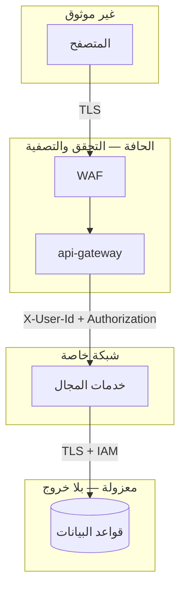
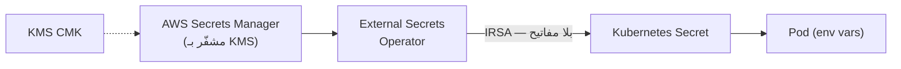

# 07 — الأمان

## 1. نموذج التهديد المختصر

| الأصل | التهديد | الضابط |
|---|---|---|
| حسابات المستخدمين | حشو بيانات الاعتماد | BCrypt · WAF rate limit · قفل تدريجي |
| توكنات الجلسة | سرقة وإعادة استخدام | TTL قصير · تدوير Refresh + كشف إعادة الاستخدام |
| بيانات الدفع | تسريب بيانات البطاقات | **لا نخزّنها إطلاقًا** — tokenization لدى المزوّد |
| الأسعار | تلاعب العميل بالسعر | السعر يُقرأ من الكتالوج على الخادم |
| المخزون | حجز خبيث/تكرار | idempotency · TTL للحجز · حدود الكمية |
| قواعد البيانات | وصول مباشر | شبكات معزولة · Security Groups · بلا مسار خروج |
| الأسرار | تسريب في Git | Secrets Manager + IRSA — لا سرّ في المستودع |
| بيانات اعتماد العقدة | SSRF لسرقة IMDS | حجب `169.254.169.254` في NetworkPolicy |

---

## 2. المصادقة والتفويض

### 2.1 كلمات المرور

BCrypt بتكلفة 10. عند فشل تسجيل الدخول نُشغّل مقارنة وهمية بهاش ثابت — بلا ذلك يكشف فرق التوقيت أي بريد مسجّل وأيّه لا:

```java
// services/identity-service/.../AuthService.java
if (maybeUser.isEmpty()) {
    encoder.matches(req.password(), DUMMY_HASH);   // زمن ثابت
    throw ApiException.unauthorized("INVALID_CREDENTIALS", "Invalid email or password");
}
```

### 2.2 التوكنات

| النوع | العمر | التخزين | الإبطال |
|---|---|---|---|
| Access (JWT) | 15 دقيقة | ذاكرة العميل | لا — ينتهي وحده |
| Refresh (opaque) | 30 يومًا | جدول، مخزَّن كـ SHA-256 | فوري |

**تدوير مع كشف إعادة الاستخدام:** كل تحديث يُبطل التوكن القديم ويصدر جديدًا بنفس `family_id`. وصول توكن مسحوب يعني تسريبًا ⇒ نُبطل العائلة كلها:

```java
if (stored.getRevokedAt() != null) {
    refreshTokens.revokeFamily(stored.getFamilyId(), Instant.now());
    throw ApiException.unauthorized("TOKEN_REUSE_DETECTED", "...");
}
```

### 2.3 خطة الإنتاج

| الآن | الإنتاج |
|---|---|
| HS256 بسرّ مشترك | **RS256/ES256**: توقيع بمفتاح خاص في KMS ونشر JWKS — لا خدمة تحتاج معرفة السرّ |
| التوكنات في `localStorage` | **Refresh في كوكي HttpOnly + SameSite=Strict**، والـ Access في الذاكرة فقط |
| بلا MFA | Amazon Cognito أو TOTP |

> `localStorage` مكشوف لـ XSS. اختير هنا لبساطة العرض التوضيحي، والملاحظة مكتوبة صراحةً في [الكود](../frontend/web/src/store/auth.ts).

---

## 3. حدود الثقة



**قواعد ثابتة:**

1. **لا شيء من العميل موثوق** — الأسعار والمجاميع والصلاحيات تُحسب على الخادم.
2. الـ gateway يحذف أي ترويسة `X-User-Id` قادمة من الخارج ويضعها بنفسه بعد التحقق.
3. المسارات المطابقة لـ `/internal/` أو `/admin/` أو `/actuator` تُرد بـ **404** عند الحافة — لا 403، حتى لا نؤكد وجودها.
4. NetworkPolicy هي الحاجز الحقيقي: خدمات المجال لا تقبل اتصالًا إلا من الـ gateway.

```typescript
// services/api-gateway/src/routes/proxy.ts
const BLOCKED_PATH = /\/(internal|admin|actuator)(\/|$|\?)/i;
```

---

## 4. حماية سلامة الطلب

### 4.1 السعر من مصدره لا من العميل

```java
// order-service — طلب الإنشاء لا يحتوي على أسعار إطلاقًا
List<CatalogProduct> products = catalog.fetchBySkus(skus, locale);
order.addItem(new OrderItem(p.sku(), p.title(), p.image(),
        p.priceMinor(),      // ← من الكتالوج
        quantity, null));
```

فشل الكتالوج **يُفشل** إنشاء الطلب عمدًا: طلب بأسعار غير مؤكدة أسوأ من طلب مرفوض.

### 4.2 Idempotency

```
POST /api/v1/orders
Idempotency-Key: 550e8400-e29b-41d4-a716-446655440000
```

المفتاح يُحفظ في نفس معاملة الطلب. إعادة الإرسال تعيد الطلب نفسه، والمفتاح مرتبط بالمستخدم فلا يستطيع أحد قراءة طلب غيره بتخمين مفتاح.

### 4.3 المبالغ كأعداد صحيحة

كل المبالغ `BIGINT` بالوحدة الصغرى. لا `FLOAT` ولا `DOUBLE` في أي مكان — `0.1 + 0.2 != 0.3` مشكلة محاسبية حقيقية لا نظرية.

---

## 5. أمان الشبكة

| الطبقة | الضابط |
|---|---|
| الحافة | WAF: OWASP Top 10 · Bot Control · حد 100 طلب/دقيقة على `/auth/*` |
| النقل | TLS 1.2+ في كل مكان، بما فيه الاتصال بقواعد البيانات |
| VPC | ثلاث طبقات: public / private / data — الأخيرة بلا مسار خروج |
| العنقود | NetworkPolicy: منع افتراضي + سماح صريح |
| IMDS | محجوب في NetworkPolicy — يمنع SSRF من سرقة أوراق اعتماد العقدة |
| النقاط الطرفية | VPC Endpoints: حركة AWS لا تخرج للإنترنت |

---

## 6. أمان الحاويات

```yaml
securityContext:
  runAsNonRoot: true
  runAsUser: 10001
  allowPrivilegeEscalation: false
  readOnlyRootFilesystem: true      # /tmp فقط قابل للكتابة عبر emptyDir
  capabilities:
    drop: ["ALL"]
  seccompProfile:
    type: RuntimeDefault
```

على مستوى الـ namespace: `pod-security.kubernetes.io/enforce: restricted`.

**الصور:** متعددة المراحل (لا أدوات بناء في الصورة النهائية) · Alpine/slim · فحص Trivy عند الدفع · وسوم غير قابلة للتعديل في ECR · ثغرة CRITICAL توقف النشر.

---

## 7. إدارة الأسرار



- **صفر أسرار في Git.** ملف `.env.example` يحوي قيم تطوير محلية فقط، ومكتوب عليها ذلك.
- **IRSA** يُلغي الحاجة لأي مفتاح وصول داخل حاوية.
- تدوير أسرار قواعد البيانات تلقائي عبر Secrets Manager.
- `gitleaks` يفحص كل PR.

---

## 8. حماية البيانات

| الحالة | الآلية |
|---|---|
| At rest | KMS CMK لكل مخزن: Aurora · DocumentDB · ElastiCache · S3 · MSK · DynamoDB · EBS |
| In transit | TLS إجباري لكل اتصال، بما فيه داخل الـ VPC |
| النسخ الاحتياطي | Aurora 35 يومًا · PITR · نسخ عبر المناطق للحرج |
| السجلات | لا نسجّل PII — الترويسات الحساسة محجوبة في pino |

```typescript
logger: {
  redact: ['req.headers.authorization', 'req.headers.cookie'],
}
```

---

## 9. الامتثال

### 9.1 PCI-DSS

**النطاق مُصغَّر عمدًا:** لا تلمس المنصة بيانات بطاقة إطلاقًا. المستخدم يُدخل بياناته في iframe/SDK من المزوّد، ونستقبل رمزًا (token) فقط. هذا يبقينا في **SAQ-A** بدل التدقيق الكامل.

### 9.2 GDPR / حماية البيانات

| الحق | التنفيذ |
|---|---|
| الوصول | `GET /api/v1/users/me` + تصدير الطلبات |
| المحو | إخفاء الهوية بدل الحذف — الطلبات سجل محاسبي لا يجوز حذفه |
| التصحيح | `PATCH /api/v1/users/me` |
| إقامة البيانات | نشر إقليمي (`me-south-1`) |

### 9.3 التدقيق

CloudTrail · EKS audit logs · `payment_audit` (append-only) · `processed_events` · VPC Flow Logs.

---

## 10. الاستجابة للحوادث

| الحادث | الخطوة الأولى |
|---|---|
| تسريب توكن | `POST /auth/logout-all` للمستخدم · تدوير `JWT_SECRET` (يُبطل كل الجلسات) |
| بيانات اعتماد قاعدة بيانات مكشوفة | تدوير في Secrets Manager · تُلتقط تلقائيًا خلال ساعة |
| DDoS | Shield Advanced · تشديد حدود WAF · تفعيل غرفة الانتظار |
| ثغرة حرجة في صورة | إعادة بناء ونشر (الخط كله ~15 دقيقة) |
| احتيال في الطلبات | Amazon Fraud Detector · تعليق الحساب · عكس الحجز |

---

## 11. ما هو ناقص عمدًا (وواجب قبل الإنتاج)

هذا مشروع تعليمي. قبل أي استخدام حقيقي:

1. **RS256 + JWKS** بدل السرّ المشترك.
2. **كوكي HttpOnly** للـ refresh token بدل `localStorage`.
3. **MFA** للحسابات الإدارية.
4. **mTLS بين الخدمات** عبر service mesh (Istio / App Mesh).
5. **تدقيق أمني خارجي** واختبار اختراق.
6. **قفل الحساب** بعد محاولات فاشلة متتالية.
7. **تحقق من البريد والهاتف** فعليًا.
8. **CSP كامل** على الواجهة.
9. **Amazon Fraud Detector** على مسار الطلبات.
10. **مراجعة صلاحيات IAM** بمبدأ أقل امتياز على كل دور.
