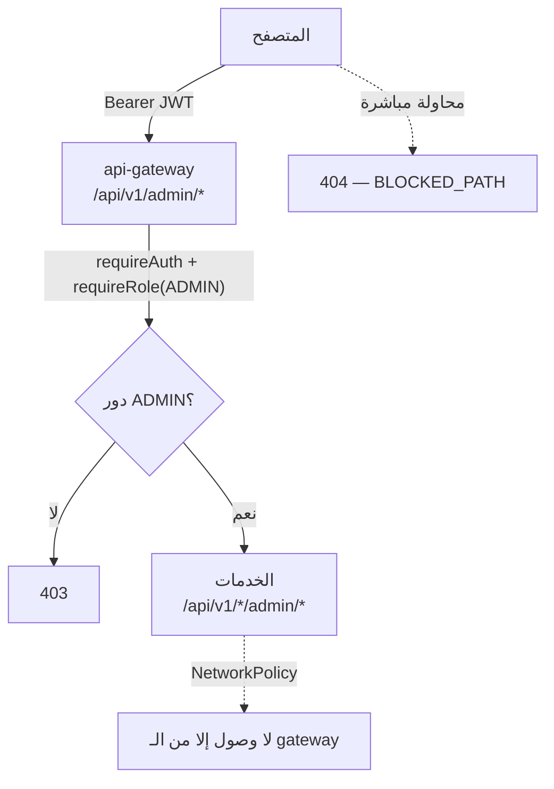

# 08 — لوحة التحكم (Admin Dashboard)

## 1. الدخول

| | |
|---|---|
| الرابط | http://localhost:3000/admin |
| الحساب | `admin@noon.local` / `Admin@123` |
| الأدوار | `CUSTOMER`, `ADMIN` |

> المشرف يُبذر عبر ترحيل Flyway (`V3__seed_admin.sql`) للتطوير المحلي فقط.
> في الإنتاج يُنشأ عبر Cognito أو سكربت إداري بكلمة مرور من Secrets Manager
> وعليه MFA — لا يُنشأ مشرف بترحيل قاعدة بيانات أبدًا.

---

## 2. الشاشات

| الشاشة | الوظيفة |
|---|---|
| `/admin` | مؤشرات: الإيراد · الطلبات حسب الحالة · الكتالوج · المخزون المنخفض |
| `/admin/products` | سرد، بحث، فلترة بالحالة، تفعيل/إخفاء، أرشفة |
| `/admin/products/new` | إنشاء منتج + ضبط مخزونه الابتدائي |
| `/admin/products/[sku]` | تحرير كامل: النصوص، الصور، المواصفات، الوسوم، الحالة |
| `/admin/orders` | سرد كل الطلبات، فلترة بالحالة، بحث برقم الطلب |
| `/admin/orders/[id]` | التفاصيل + تغيير الحالة + الإلغاء مع تعويض |
| `/admin/inventory` | ضبط الكميات، تصفية المخزون المنخفض |

---

## 3. طبقات الحماية



**أربع طبقات، كل واحدة كافية وحدها لو سقطت التي فوقها:**

1. **الواجهة** — `AdminLayout` يخفي اللوحة لغير المشرف. *هذا ليس أمانًا*، إخفاء زر لا يمنع أحدًا؛ الغرض تجربة استخدام.
2. **الحافة** — الـ gateway يحجب أي مسار يطابق `/(internal|admin|actuator)/` بـ **404** لا 403، فلا نؤكد وجودها أصلًا.
3. **التفويض** — `/api/v1/admin/*` هو النافذة الوحيدة، خلف `requireAuth` + `requireRole('ADMIN')` على توكن موقّع.
4. **الشبكة** — `NetworkPolicy` في العنقود لا تسمح بالوصول لمنافذ الخدمات إلا من الـ gateway.

```typescript
// services/api-gateway/src/routes/proxy.ts
const BLOCKED_PATH = /\/(internal|admin|actuator)(\/|$|\?)/i;
```

---

## 4. توجيه مسارات الإدارة

الـ gateway يعيد كتابة المسار العام إلى مسار الخدمة الداخلي:

| العميل | الخدمة |
|---|---|
| `/api/v1/admin/products/*` | catalog → `/api/v1/products/admin/*` |
| `/api/v1/admin/orders/*` | order → `/api/v1/orders/admin/*` |
| `/api/v1/admin/inventory/*` | inventory → `/api/v1/inventory/admin/*` |
| `/api/v1/admin/dashboard` | تجميع إحصاءات الثلاثة في نداء واحد |

سقوط خدمة لا يُفرّغ اللوحة — تُعرض بطاقاتها فارغة مع تنبيه، وباقي الأرقام تظهر.

---

## 5. قواعد مطبَّقة في الخادم

هذه ليست تحققات شكلية في الواجهة — الخادم يرفضها حتى لو استُدعي مباشرةً:

| القاعدة | السلوك |
|---|---|
| **الحذف أرشفة لا محو** | الطلبات التاريخية تشير إلى الـ sku؛ محو المستند يكسر فواتير قديمة |
| **لا خفض مخزون تحت المحجوز** | `409 BELOW_RESERVED` — حماية طلبات قيد التنفيذ |
| **آلة حالة الطلب تسري على المشرف** | `CONFIRMED → DELIVERED` مرفوض بـ `409`؛ المسار الصحيح `PROCESSING → SHIPPED → DELIVERED` |
| **الإلغاء الإداري يعوّض** | يمر بنفس مسار الـ Saga: تحرير المخزون + إبطال الدفع |
| **تغيير الحالة يُبطل الكاش وفهرس البحث** | `INACTIVE` ⇒ حذف من OpenSearch فورًا عبر حدث `catalog.product.deleted` |
| **المبالغ بالوحدة الصغرى** | المشرف يُدخل `1250.50` ونحوّل إلى `125050` مرة واحدة عند الحفظ |

---

## 6. المنتج والمخزون: خدمتان لا معاملة واحدة

إنشاء منتج يمس خدمتين لا يمكن ضمّهما في معاملة واحدة. الترتيب مقصود:

```typescript
await adminApi.saveProduct({ ... });        // 1) الكتالوج — إلزامي
try {
  await adminApi.saveStock(sku, stock);      // 2) المخزون — قد يفشل
} catch {
  toast.warning('حُفظ المنتج، لكن تعذّر ضبط المخزون');
}
```

فشل الخطوة الثانية لا يُلغي الأولى: المنتج محفوظ ويمكن ضبط مخزونه من شاشة
المخزون. **البديل أسوأ**: منتج بلا صف مخزون يُرفض عند أول طلب بـ
`SKU_NOT_FOUND`، ولهذا ننبّه المشرف صراحةً بدل الصمت.

---

## 7. الاختبار

```bash
make admin-test
```

يغطي 28 حالة: الصلاحيات (مجهول/عميل/مشرف)، حجب المسارات الخام، المؤشرات،
دورة CRUD كاملة، ظهور المنتج واختفاؤه من المتجر حسب حالته، حراسة المخزون،
ورفض الانتقالات غير المسموحة في الطلبات.

---

## 8. ما هو ناقص عمدًا

1. **سجل تدقيق للإجراءات الإدارية** — من غيّر ماذا ومتى (`payment_audit` موجود للدفع فقط).
2. **رفع الصور** — نقبل روابط؛ الإنتاج يحتاج رفعًا إلى S3 مع معالجة بـ Lambda.
3. **صلاحيات دقيقة** — دور `ADMIN` واحد؛ متجر حقيقي يحتاج فصل «مدير كتالوج» عن «خدمة عملاء».
4. **تحرير جماعي** — تغيير أسعار مئة منتج دفعة واحدة.
5. **MFA** — إلزامي لأي حساب إداري في الإنتاج.
6. **حد معدّل للعمليات الإدارية** — يمنع مسح الكتالوج بحلقة واحدة.
